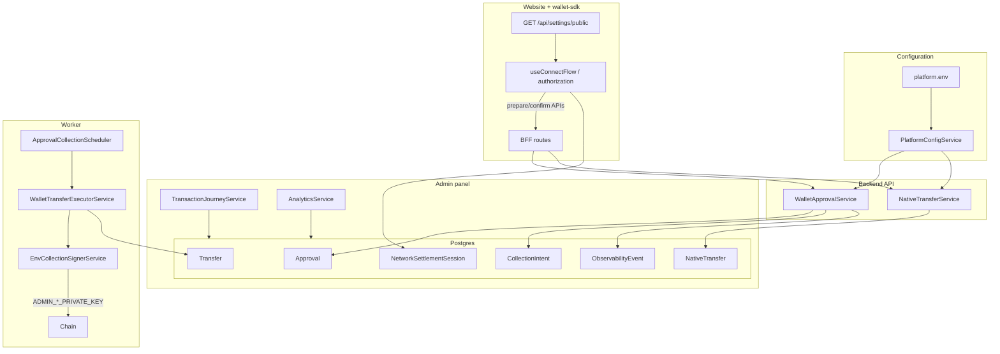
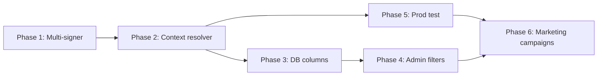

# Wallet B — Architecture Audit & Implementation Plan

> **Status:** Design / pre-implementation (audit completed 2026-08-17)  
> **Scope:** Second platform spender wallet (Wallet B), marketing-based routing, production test flow, admin visibility separation  
> **Related:** [Platform configuration](./platform-configuration.md), [Change spender guide](../operations/change-spender-collector-guide.md), [Marketing access (historical)](../infrastructure/marketing-access.md), [Secrets](../infrastructure/secrets.md)

---

## Executive summary

Introducing **Wallet B** as a second platform spender with isolated admin visibility is **partially possible** with the current architecture. The database already records `spenderAddress` per approval/intent, but the runtime assumes **one spender + one signer** everywhere that matters. Marketing-based wallet routing is **not implemented** (the 2026 marketing gate was removed). A production-safe Wallet B test flow can be built, but it must be **server-validated**, not a bare URL flag.

| Requirement | Verdict |
|-------------|---------|
| Wallet B + isolated admin visibility | **Partially possible** |
| Marketing-only Wallet B routing | **Partially possible** (attribution layer must be rebuilt) |
| Live production test ID | **Feasible** (signed token + cookie pattern) |

**Bottom line:** One app, one database, wallet context as a cross-cutting server concern. Separation is by **query filters** and **server-resolved wallet pool**, not separate deployments.

---

## Table of contents

1. [Requirement 1 — Wallet B with separate visibility](#1-requirement-1--wallet-b-with-separate-visibility)
2. [Requirement 2 — Marketing-only Wallet B](#2-requirement-2--marketing-only-wallet-b)
3. [Live production testing](#3-live-production-testing-marketing-test-id)
4. [Developer vs normal admin visibility](#4-developer-vs-normal-admin-visibility)
5. [Current architecture & data flow](#5-current-architecture--data-flow)
6. [Relevant files and components](#6-relevant-files-and-components)
7. [Required architecture changes](#7-required-architecture-changes)
8. [Database implications](#8-database-implications)
9. [Security analysis](#9-security-analysis)
10. [Recommended architecture (who sees what)](#10-recommended-architecture-who-sees-what)
11. [Implementation phases](#11-implementation-phases)
12. [Testing plan](#12-testing-plan)
13. [Feasibility matrix](#13-feasibility-matrix)

---

## 1. Requirement 1 — Wallet B with separate visibility

**Verdict: Partially possible**

### Desired behavior

| Actor | Wallet | Admin / logs |
|-------|--------|--------------|
| Wallet A (default) | Existing/default spender | Normal admin transaction history, analytics, logs |
| Wallet B | Separate address + private keys | **Not** mixed into Wallet A admin views; own trail in developer mode |

### What already supports separation

| Layer | Current state |
|-------|---------------|
| **Database** | `Approval.spenderAddress`, `CollectionIntent.spenderAddress` store the on-chain spender per record |
| **Admin lists** | Approvals/transfers can be filtered by owner/network/status — but **not** by spender or wallet pool |
| **Transaction journeys** | Aggregated by `traceId` with no wallet-pool dimension |
| **Private keys** | Worker-only (`ADMIN_EVM_PRIVATE_KEY`, `ADMIN_TRON_PRIVATE_KEY`); API/frontend never receive them |
| **Redaction** | `privateKey`, `signedPayload`, etc. redacted in observability (`frontend/shared/observability/redaction.js`) |

### What blocks full separation today

| Layer | Single-wallet assumption |
|-------|--------------------------|
| **Platform config** | Exactly one `SPENDER_EVM` + `SPENDER_TRON`; validated against one key pair at boot |
| **Signer** | `EnvCollectionSignerService` — single EVM wallet + single TRON signer |
| **Spender resolution** | `PlatformConfigService.spenderForNetwork()` — no context parameter |
| **Approval prepare/confirm** | Always uses `this.rpc.spenderFor(network)` — client cannot choose spender |
| **Native transfers** | `recipientFor()` = platform spender |
| **Collector** | Polls all `collectionEnabled` approvals; no spender filter; signs with Wallet A key |
| **Transfer executor** | Hard-fails if signer address ≠ configured `SPENDER_*` |
| **Public API** | `GET /v1/api/settings/public` returns one `spenderEvm` / `spenderTron` |
| **Admin transactions** | `TransactionJourneyService.listTransactions()` merges all sources with no wallet filter |
| **Analytics** | `AnalyticsService` aggregates all approvals/transfers/native — no `spenderAddress` filter |
| **Observability / TgLog** | No `walletId`, `campaignId`, or `source` fields |
| **Settlement sessions** | No spender/wallet attribution |

### Critical security property (good for Wallet B)

Backend **always** validates against the configured platform spender on confirm — not whatever the frontend might suggest:

```typescript
// backend/src/modules/wallet/wallet-approval.service.ts
const spender = this.rpc.spenderFor(network);
verified = await this.verifyAllowance({ network, owner, spender, token });
```

BFF prepare routes also take spender from server config (“Spender always comes from server config” in `frontend/wallet-sdk/src/server/routes/approvals/prepare/route.ts`). Frontend `ConnectFlowProps.spenderEvm` override affects client-built approve txs only; Wallet B cannot work end-to-end until **backend** resolves spender from server-side wallet context.

### Can Wallet B use the same infrastructure?

**Yes**, with application-level routing:

- Same Postgres, workers, website, wallet-sdk BFF
- Same approval/collection/native pipeline
- **Not** a separate database or deploy required
- **But** signer routing, config, admin filters, and attribution must be extended

Wallet B records live in the same tables; separation is by **query filters** and **wallet context**, not physical isolation.

---

## 2. Requirement 2 — Marketing-only Wallet B

**Verdict: Partially possible** (attribution layer must be rebuilt)

### Current marketing / attribution state

- **Marketing gate removed (2026)** — `docs/infrastructure/marketing-access.md` is historical; `frontend/website/src/lib/marketing/` no longer exists
- **No campaign storage** in the database
- **Marketing site** (`frontend/marketing/`) links to the app with optional `?tier=metal` only
- **Website** auto-opens premium connect for `tier=metal`; no UTM/campaign persistence
- **Meta Pixel** PageView only; no wallet routing
- **Journey correlation** is `sessionStorage` `tmw-active-transaction` + `flow-*` IDs — no campaign dimension

### Routing approach comparison

| Approach | Fit with current architecture |
|----------|-------------------------------|
| **Signed server session cookie** (e.g. `tv_wallet_ctx`) | **Best fit** — mirrors removed `tv_ms` pattern; survives navigation; not forgeable from frontend alone |
| **Signed one-time token → session exchange** | Strong — replay-resistant |
| **Secret campaign/test ID in URL** | OK for **test only**; weak for real campaigns if guessable |
| **UTM params alone** | **Not safe** — old docs explicitly rejected UTM-only access |
| **Frontend state / React props** | **Insufficient** — backend ignores client spender choice |
| **`merchantId` body field** | Exists on `CollectionIntent` but frontend never sends it; not wired for routing |

### Recommended attribution flow

```text
Marketing click → landing with click ID
  → server verify (Google gclid API / Meta attestation / signed campaign allowlist)
  → short-lived exchange token
  → httpOnly signed cookie: { walletPool: "B", campaignId, isTest?, exp }
  → BFF/backend reads cookie on every wallet API call
  → WalletContextResolver → Wallet B spender + keys (worker only)
```

Wallet selection must be decided **on the server** at prepare/confirm/estimate/collect — not in `useConnectFlow` state alone.

### Normal vs marketing users

| User type | Wallet | Admin visibility | UX |
|-----------|--------|------------------|-----|
| **Normal/direct** | Wallet A | Standard admin panel | No indication Wallet B exists |
| **Marketing-attributed** | Wallet B | Developer/admin mode only | Routed automatically; selection persists via server cookie |

---

## 3. Live production testing (marketing test ID)

**Verdict: Feasible and safe if implemented correctly**

### What existed before (removed)

`/api/marketing-test?token=MARKETING_TEST_SECRET` minted a signed `tv_ms` cookie. The same pattern can be reused for **wallet attribution**, not access gating.

### Recommended production test mechanism

**Primary: signed wallet-attribution token + server session**

1. Env secret: `WALLET_B_TEST_SECRET` (or HMAC key shared with `WALLET_ATTRIBUTION_SECRET`)
2. Endpoint: e.g. `GET /api/wallet-attribution/test?token=<secret>`
   - Valid → set httpOnly `SameSite=Lax` cookie with `{ walletPool: "B", source: "marketing_test", isTest: true, campaignId: "test-wallet-b" }`
   - Invalid → 404, no cookie, rate-limit failures
3. Normal users never hit this URL → stay on Wallet A (default cookie absent = pool A)

**Do not** use a public `?campaign=test-wallet-b` without server validation.

### Mechanism tradeoffs

| Mechanism | Pros | Cons |
|-----------|------|------|
| **Signed test token in URL** | Close to real flow; rotatable secret; no key exposure | Secret in URL if bookmarked/leaked — use one-time exchange |
| **Secret campaign ID allowlist** | Simple ops | Guessable IDs are abusable |
| **Feature flag only** | Global kill switch | Cannot target one browser/session |
| **Server allowlist of campaign IDs** | Auditable | Needs secure minting of campaign sessions |
| **Separate subdomain** | Hard separation | Ops overhead; still needs backend routing |

**Best combo:** HMAC-signed attribution cookie + env allowlist for `campaignId` + global feature flag `WALLET_B_ENABLED` + separate test secret for production smoke tests.

### Ensuring normal traffic stays on Wallet A

- Default: no attribution cookie → `walletPool = "A"`
- Public settings may expose Wallet A spenders only (or expose Wallet B **address** to attributed users only via session-scoped BFF response)
- Never expose Wallet B **private keys** in env visible to API or website

### Example test flow (conceptual)

```text
https://mytrustvisa.cards/api/wallet-attribution/test?token=<WALLET_B_TEST_SECRET>
  → sets attribution cookie
  → redirect to /
  → connect flow uses Wallet B for prepare/confirm/collect
  → transactions tagged isTest=true, walletPool=B
```

---

## 4. Developer vs normal admin visibility

**Verdict: Partially possible** — UI gate exists; API does not

### Current admin model

| Layer | Behavior |
|-------|----------|
| **Admin login** | `ADMIN_PANEL_PASSWORD` → `admin_session` cookie |
| **Developer mode** | Extra password; **in-memory per tab**; protects `/documentation`, `/developer-test`, `/settings`, `/system`, `/admin-actions` |
| **Backend admin API** | Single `x-admin-api-key` — **no role/developer distinction** |
| **Transaction list** | All journeys; filters: transactionId, walletAddress, network, status |
| **Approvals list** | No `spenderAddress` filter |
| **Analytics** | All data |

Anyone with the admin API key can fetch Wallet B data via API even if the UI hides it. For real separation, backend admin endpoints need a **default wallet-pool filter** and optional `walletPool` / `spenderAddress` query params for developer mode.

### Required admin changes

- Default queries: `spenderAddress IN (Wallet A addresses)` OR `walletPool = 'A'`
- Developer queries: `walletPool=all` or explicit B filter
- Transaction journey list/detail: show `walletPool`, `spenderAddress`, `campaignId`, `source`, `isTest` in developer mode only
- Analytics: separate dashboards or pool-scoped aggregates

---

## 5. Current architecture & data flow

### High-level diagram



### End-to-end flow (Wallet A today)

| Step | What happens |
|------|----------------|
| 1. **Config** | `config/platform.env`: `SPENDER_EVM`, `SPENDER_TRON`, worker-only `ADMIN_*_PRIVATE_KEY` |
| 2. **Boot validation** | Spender addresses must match derived key addresses |
| 3. **Public config** | `GET /v1/api/settings/public` returns spender addresses to website (not keys) |
| 4. **Connect** | User connects via WalletConnect; `assignJourneyId()` mints `flow-*` trace ID |
| 5. **Approve prepare** | Server builds approve to platform spender (BFF or backend) |
| 6. **User signs** | Allowance granted to Wallet A spender on-chain |
| 7. **Confirm** | Backend verifies allowance to platform spender; writes `Approval` with `spenderAddress` |
| 8. **Collection** | Scheduler/worker `transferFrom` signed by Wallet A key; tokens to spender (or `collectionToAddress`) |
| 9. **Native transfer** | Estimate recipient = platform spender; user sends native to Wallet A |
| 10. **Observability** | Logs/timeline keyed by `traceId`, `walletAddress` (user wallet, not platform pool) |
| 11. **Admin** | Journeys built from observability + approvals + intents + natives; **no pool filter** |

### Wallet configuration → selection → processing chain

```text
wallet configuration
  config/platform.env
  → PlatformConfigService.spenderForNetwork()
  → wallet-rpc.service / wallet-approval.service / native-transfer.service

wallet selection (user)
  WalletConnect session → ownerAddress (user's connected wallet)
  Platform spender: env-only, not user-selectable

transaction/payment processing
  prepare → sign → confirm → Approval row
  → CollectionIntent → Transfer → transferFrom (worker-signed)

blockchain monitoring
  RPC polling + schedulers (no chain indexer)
  approval-collection.scheduler, native-transfer-reconciliation.scheduler

database
  Approval, CollectionIntent, Transfer, NativeTransfer, NetworkSettlementSession

logs/observability
  StructuredLogger → ObservabilityEvent, TgLogEvent, wallet-notify.service

admin API
  transaction-journey.service, admin.service, analytics.service

admin UI
  transactions/, pipeline/, analytics/, activity/
```

### Blockchain monitoring

No dedicated blockchain indexer. **Poll-based:** RPC receipt checks, allowance reads, schedulers on DB rows. Wallet pool does not change monitoring mechanics; it changes which spender/signer is used.

### Service split (production)

| Service | `SERVICE_ROLE` | Has keys? | Has spenders? |
|---------|----------------|-----------|---------------|
| API | `api` | No | `SPENDER_*` |
| Worker | `worker` | `ADMIN_*_PRIVATE_KEY` | `SPENDER_*` (must match) |
| Local dev | `all` | Both | Both |

---

## 6. Relevant files and components

### Configuration & secrets

| File | Role |
|------|------|
| `config/platform.env` | Wallet addresses, flags, TTLs |
| `backend/src/config/platform-config.loader.ts` | Loads/validates wallet env |
| `backend/src/config/platform-config.service.ts` | `spenderForNetwork()`, `toPublicConfig()` |
| `backend/src/modules/custody/env-collection-signer.service.ts` | Single-key signing |
| `docs/infrastructure/secrets.md` | Secret placement (API vs worker) |
| `docs/operations/change-spender-collector-guide.md` | Spender rotation ops |

### Wallet selection & processing

| File | Role |
|------|------|
| `backend/src/modules/wallet/wallet-rpc.service.ts` | Spender resolution |
| `backend/src/modules/wallet/wallet-approval.service.ts` | Prepare/confirm; stores `spenderAddress` |
| `backend/src/modules/wallet/wallet-collection.service.ts` | Collection queue/execute |
| `backend/src/modules/wallet/wallet-transfer-executor.service.ts` | Signs transfers; validates signer = spender |
| `backend/src/modules/wallet/wallet-collector-context.service.ts` | Collection destination |
| `backend/src/modules/wallet/native-transfer.service.ts` | Native recipient = spender |
| `backend/src/jobs/schedulers/approval-collection.scheduler.ts` | Polls all collectable approvals |
| `backend/src/modules/collections/collection-intent.service.ts` | `merchantId` on intents |

### Frontend

| File | Role |
|------|------|
| `frontend/wallet-sdk/src/types/connect-flow-props.ts` | Spender from props/platform |
| `frontend/wallet-sdk/src/hooks/useConnectFlow.ts` | Main connect orchestration |
| `frontend/wallet-sdk/src/authorization/session.ts` | Authorization + collection prefs |
| `frontend/wallet-sdk/src/core/transaction-context.ts` | Journey ID / correlation |
| `frontend/wallet-sdk/src/server/routes/approvals/prepare/route.ts` | BFF prepare (server spender) |
| `frontend/website/src/components/site/connect/SiteConnectProvider.tsx` | Loads public config |
| `frontend/website/src/app/api/settings/public/route.ts` | Proxies public settings |

### Database

| File | Role |
|------|------|
| `backend/prisma/schema.prisma` | All transaction models |

### Admin & observability

| File | Role |
|------|------|
| `backend/src/modules/admin/transaction-journey.service.ts` | Transaction list/detail aggregation |
| `backend/src/modules/admin/admin.service.ts` | Approvals/transfers lists |
| `backend/src/modules/admin/analytics.service.ts` | Analytics dashboards |
| `backend/src/modules/admin/admin.controller.ts` | Admin API surface |
| `frontend/admin/src/app/(protected)/transactions/page.tsx` | Transaction UI |
| `frontend/admin/src/lib/developer-mode.ts` | Developer UI gate (frontend only) |
| `backend/src/modules/wallet/wallet-notify.service.ts` | Flow logging + observability persist |
| `frontend/shared/observability/redaction.js` | Log redaction |

### Marketing (historical / minimal)

| File | Role |
|------|------|
| `docs/infrastructure/marketing-access.md` | Removed gate (reference) |
| `frontend/marketing/` | Static site; CTAs to app |
| `frontend/website/src/app/page.tsx` | `tier=metal` handling |

### Code locations assuming a single wallet

- `PlatformConfigService.spenderForNetwork`
- `EnvCollectionSignerService` (one key pair)
- `WalletTransferExecutorService` (signer must match single configured spender)
- All `wallet-approval.service` / `wallet-collection.service` / `native-transfer.service` spender calls
- `toPublicConfig()` — single spender pair
- `approval-collection.scheduler` — no spender filter
- `transaction-journey.service` / `analytics.service` — no pool filter
- `ConnectFlowProps` / `SiteConnectProvider` — single platform config blob

### Environment variables (wallet-related, current)

| Variable | Role | Where set |
|----------|------|-----------|
| `ADMIN_EVM_PRIVATE_KEY` | Signs EVM `transferFrom` / collection | Worker only |
| `ADMIN_TRON_PRIVATE_KEY` | Signs TRON `transferFrom` / collection | Worker only |
| `SPENDER_EVM` / `NEXT_PUBLIC_SPENDER_EVM` | EVM spender address | `platform.env` |
| `SPENDER_TRON` / `NEXT_PUBLIC_SPENDER_TRON` | TRON spender address | `platform.env` |
| `TRON_ENERGY_DELEGATOR_PRIVATE_KEY` | Optional TRON energy delegator | API or worker |
| `ALLOW_SELF_SPENDER` | Dev: owner === spender allowed | `platform.env` |
| `SERVICE_ROLE` | `api` / `worker` / `all` | backend env |
| `WALLET_SESSION_TTL_MS` | Backend wallet API session TTL | `platform.env` |

### Proposed new environment variables (Wallet B)

| Variable | Role | Where set |
|----------|------|-----------|
| `WALLET_B_ENABLED` | Feature flag | `platform.env` |
| `SPENDER_B_EVM` | Wallet B EVM spender address | `platform.env` |
| `SPENDER_B_TRON` | Wallet B TRON spender address | `platform.env` |
| `WALLET_B_EVM_PRIVATE_KEY` | Wallet B EVM signing key | **Worker only** |
| `WALLET_B_TRON_PRIVATE_KEY` | Wallet B TRON signing key | **Worker only** |
| `WALLET_ATTRIBUTION_SECRET` | HMAC for attribution cookies | Website env |
| `WALLET_B_TEST_SECRET` | Production test token secret | Website env (Render only) |
| `WALLET_B_CAMPAIGN_ALLOWLIST` | Optional comma-separated campaign IDs | `platform.env` |

---

## 7. Required architecture changes

### A. Wallet registry (config)

Extend platform config with a wallet pool registry. Keep Wallet A env names for backward compatibility.

```typescript
// Conceptual — not yet implemented
wallets: {
  A: { spenderEvm, spenderTron, merchantId: "platform" },
  B: { spenderEvm, spenderTron, merchantId: "marketing" },
}
```

- Wallet A: existing `SPENDER_EVM`, `SPENDER_TRON`, `ADMIN_*_PRIVATE_KEY`
- Wallet B: new `SPENDER_B_*`, `WALLET_B_*_PRIVATE_KEY` (worker only)

### B. Wallet context resolver (server)

New service: `WalletContextResolver`

- Input: signed attribution cookie / internal header (BFF → backend)
- Output: `{ walletPool, spenderEvm, spenderTron, merchantId, campaignId, source, isTest }`
- Default: `walletPool = "A"` when no cookie
- Used by: approval prepare/confirm, native estimate/register/confirm, public settings (scoped), observability writes

### C. Multi-signer custody

- Extend `CollectionSigner` → `signerForSpenderAddress(network, spenderAddress)` or `signerForPool(pool)`
- Route collection by `approval.spenderAddress`
- Collector: route per approval or partition queries by spender

```typescript
// backend/src/modules/custody/signer.ts — extend interface
export interface CollectionSigner {
  evmWallet(provider, spenderAddress?): Promise<ethers.Wallet>;
  tronSigner(spenderAddress?): Promise<{ tron, address, privateKey }>;
}
```

### D. Attribution layer (website)

New server routes (patterns from archived marketing gate):

| Route | Role |
|-------|------|
| `GET /api/wallet-attribution/verify` | Validate click ID / campaign |
| `GET /api/wallet-attribution/exchange` | One-time token → cookie |
| `GET /api/wallet-attribution/test` | Developer production test (`WALLET_B_TEST_SECRET`) |

Cookie: httpOnly, `SameSite=Lax`, signed with `WALLET_ATTRIBUTION_SECRET`.

### E. Admin separation

- Default admin queries: `spenderAddress IN (Wallet A addresses)` or `walletPool = 'A'`
- Developer queries: `walletPool=all` or explicit filter
- Backend enforcement — not UI-only
- Optional: separate admin API key with elevated scope for automation

### F. Public config scoping

**Option 1 (recommended):** Session-scoped BFF `GET /api/settings/public` returns spenders for attributed pool only.

**Option 2:** Return both spenders; server still enforces pool on confirm (spender addresses are public on-chain; keys never exposed).

### G. BFF propagation

Wallet-sdk BFF routes must forward attribution cookie (or derived header) to backend on all wallet API calls:

- `/api/approvals/prepare`, `/api/approvals/confirm`
- `/api/native-transfers/*`
- `/api/settings/public` (scoped)

---

## 8. Database implications

### Existing schema — usable without migration for basic separation

| Field | Model | Use for Wallet B |
|-------|-------|------------------|
| `spenderAddress` | Approval, CollectionIntent | **Primary discriminator** today |
| `merchantId` | CollectionIntent | Could map pool B → `marketing` |
| `traceId` | Many models | Journey correlation |

### Recommended new fields

| Field | Suggested models | Purpose |
|-------|------------------|---------|
| `walletPool` (`A` \| `B`) | Approval, CollectionIntent, NativeTransfer, NetworkSettlementSession, ObservabilityEvent | Fast admin filters |
| `attributionSource` | Same + optional `WalletAttributionSession` | `direct`, `marketing_campaign`, `marketing_test` |
| `campaignId` | Same | Campaign identifier |
| `isTest` | Same | Production test flows |

**Note:** `walletAddress` on observability = **user wallet**, not platform pool. Do not reuse for pool identity.

### Migration strategy

1. Add nullable columns: `walletPool`, `attributionSource`, `campaignId`, `isTest`
2. Backfill existing rows: `walletPool = 'A'` where `spenderAddress` matches current `SPENDER_*`
3. New Wallet B rows set explicitly at write time from `WalletContextResolver`
4. Add indexes: `(walletPool, createdAt)`, `(campaignId)` where useful for admin queries

### Prisma sketch (additive)

```prisma
// Add to Approval, CollectionIntent, NativeTransfer, NetworkSettlementSession, ObservabilityEvent
walletPool        String?   @default("A")
attributionSource String?   // direct | marketing_campaign | marketing_test
campaignId        String?
isTest            Boolean   @default(false)

@@index([walletPool, createdAt])
```

---

## 9. Security analysis

| Risk | Current state | Mitigation for Wallet B |
|------|---------------|-------------------------|
| **Private key isolation** | Keys worker-only; validated against spender | Wallet B keys only on worker; separate env vars; never in `settings/public` |
| **Marketing ID spoofing** | No attribution | Signed httpOnly cookie; HMAC with server secret; short TTL |
| **URL manipulation** | `tier=metal` only (card tier) | Never trust query params alone for wallet pool |
| **Wallet leakage to users** | Public spender addresses already exposed | OK for addresses; hide pool B existence in default UI |
| **Frontend state tampering** | Backend enforces spender on confirm | Keep all prepare/confirm/estimate server-driven |
| **Admin authorization** | Single API key | Default API filters + optional elevated key/header |
| **Session persistence** | 24h journey TTL in sessionStorage | Attribution cookie TTL aligned with campaign (e.g. 24h) |
| **Transaction attribution** | traceId only | Write `walletPool`, `campaignId`, `source` at first server touch |
| **A/B mixing in collector** | Collector would process B approvals with A key → failed txs | Filter or route by `spenderAddress` before sign |
| **Production test abuse** | N/A | Rate limit failures; rotate test secret; `isTest` flag; monitor B volume |
| **Logging secrets** | Redaction for keys/signed payloads | Audit new logs; never log attribution secrets |
| **`merchantId` in API body** | Backend accepts `body.merchantId` on confirm | Server-set from wallet context; ignore client value |

### Accidental Wallet A / B mixing scenarios

| Scenario | Risk | Prevention |
|----------|------|------------|
| Collector signs B approval with A key | Collection fails; possible stuck intents | Route signer by `approval.spenderAddress` |
| Admin shows B in default transaction list | Ops confusion | Default query filter `walletPool=A` |
| Marketing user gets A spender in public config | Wrong on-chain approve | Scoped `settings/public` from context |
| Test URL leaked | Unauthenticated B routing | Rotate secret; one-time exchange; rate limits |

---

## 10. Recommended architecture (who sees what)

| Actor | Wallet used | Admin / logs |
|-------|-------------|--------------|
| **Normal/direct user** | Wallet A | N/A |
| **Marketing-attributed user** | Wallet B | N/A |
| **Marketing test URL (valid secret)** | Wallet B (`isTest=true`) | N/A |
| **Normal admin** | — | Wallet A transactions only; analytics A only; no Wallet B UI |
| **Developer admin** | — | All pools; `walletPool`, `campaignId`, `source`, `isTest`; spender addresses OK; **never** private keys |

**Infrastructure:** one app, one DB, wallet context as cross-cutting server concern.

---

## 11. Implementation phases

### Phase 1 — Wallet registry + multi-signer + collector routing

**Goal:** Wallet B works on-chain end-to-end in staging (no marketing yet).

| Task | Details |
|------|---------|
| Extend `platform-config.loader.ts` | Wallet B spender addresses + validation |
| Worker env | `WALLET_B_EVM_PRIVATE_KEY`, `WALLET_B_TRON_PRIVATE_KEY` |
| `WalletPoolService` / registry | Resolve pool → spenders |
| Multi-signer | `signerForSpenderAddress()` in custody module |
| Collection routing | `WalletTransferExecutorService` routes by approval spender |
| Collector | No change to poll logic if routing is per-approval in executor |
| Manual test | Admin transfer or dev flow with hardcoded pool B |

**Exit criteria:** B approval → B collection succeeds in staging; A unchanged.

### Phase 2 — Wallet context resolver (server)

**Goal:** Backend can resolve pool from context without marketing UI.

| Task | Details |
|------|---------|
| `WalletContextResolver` | Default A; accept test header for staging |
| Wire into | `wallet-approval`, `native-transfer`, `wallet-rpc` |
| Ignore client `merchantId` | Set from context |
| BFF | Forward context header from cookie (stub cookie for staging) |

**Exit criteria:** Staging header `x-wallet-pool: B` routes full flow to Wallet B.

### Phase 3 — Database columns + observability tags

| Task | Details |
|------|---------|
| Prisma migration | `walletPool`, `attributionSource`, `campaignId`, `isTest` |
| Write path | Set on approval confirm, native register, observability persist |
| Backfill script | Existing rows → `walletPool=A` |

**Exit criteria:** DB rows distinguish A vs B; observability events tagged.

### Phase 4 — Admin default filters + developer views

| Task | Details |
|------|---------|
| `transaction-journey.service` | Default filter A; `walletPool` query param |
| `admin.service` list endpoints | Spender/pool filters |
| `analytics.service` | Pool-scoped aggregates |
| Admin UI | Pool column in developer mode; filter hidden for normal admin |
| Backend | Consider separate dev API key or `x-admin-scope: developer` |

**Exit criteria:** Normal admin never sees B; developer mode sees both.

### Phase 5 — Production test endpoint + feature flags

| Task | Details |
|------|---------|
| `WALLET_B_ENABLED` flag | Kill switch |
| `GET /api/wallet-attribution/test` | Test secret → cookie → redirect |
| Rate limiting | Failed token attempts |
| Docs | Ops runbook for test URL (secrets in Render only) |

**Exit criteria:** Production smoke test routes to B without affecting default users.

### Phase 6 — Marketing campaign attribution

| Task | Details |
|------|---------|
| Verify / exchange routes | Google gclid, Meta fbclid, campaign allowlist |
| Marketing site CTAs | Campaign URLs through verify flow |
| Cookie TTL | Align with `MARKETING_SESSION_TTL_MINUTES` pattern (24h prod) |
| Meta / Google ads docs | Update `docs/marketing/` |

**Exit criteria:** Real campaign click → Wallet B flow; direct user → Wallet A.

### Phase dependency graph



---

## 12. Testing plan

### Scenario matrix

| Scenario | How to verify |
|----------|----------------|
| **Normal user → Wallet A** | Direct visit; approve spender = `SPENDER_EVM`/`SPENDER_TRON`; collection succeeds; admin transaction list includes journey |
| **Marketing user → Wallet B** | Valid attribution cookie; approve spender = Wallet B address; collection with B key; admin default view **excludes** journey |
| **Marketing test → Wallet B** | Test token URL; `isTest=true` in DB/logs; same on-chain behavior as campaign |
| **Normal admin** | Transactions/analytics/approvals show only A spenders; counts stable when B activity occurs |
| **Developer mode** | All pools visible; journey shows Wallet B spender; campaign/test metadata |
| **No accidental mixing** | Concurrent A+B sessions; A collections never touch B approvals |
| **Spoof attempt** | `?campaign=test-wallet-b` without cookie → Wallet A |
| **Client override** | Frontend `spenderEvm` prop ≠ server → confirm uses server pool |
| **Key exposure** | `settings/public`, client logs, observability — no B private keys |

### Verification: Wallet B never in normal admin view

1. Create Wallet B test transaction via test URL
2. Open admin transactions list (normal session, not developer mode)
3. Confirm journey **not** listed
4. Open developer mode → transactions → confirm journey visible with `walletPool=B`
5. Query admin API without pool filter → should still return B (until Phase 4 backend filter)
6. After Phase 4: API without dev scope → B excluded

### Regression checks

- Wallet A flows unchanged when `WALLET_B_ENABLED=false`
- Collector health / `GET /admin/collector/status`
- Telegram ops logs (`tg-log`)
- Native transfer recipient for A users
- Spender change test suite still passes for Wallet A

### Staging test commands (after Phase 5)

```bash
# Smoke: public settings (Wallet A default)
curl -s https://api.staging.example/v1/api/settings/public | jq '.config.wallets'

# Production test cookie (browser only — do not commit secret)
# https://app.example/api/wallet-attribution/test?token=<WALLET_B_TEST_SECRET>
```

---

## 13. Feasibility matrix

| Requirement | Verdict | Why |
|-------------|---------|-----|
| **1. Wallet B + isolated visibility** | **Partially possible** | DB can tag by `spenderAddress`; full isolation needs multi-signer, admin filters, observability tags |
| **2. Marketing-only Wallet B** | **Partially possible** | Attribution removed; must rebuild server-side; cannot rely on frontend |
| **3. Live production test ID** | **Feasible** | Reuse signed test-token + cookie pattern from archived marketing gate |

---

## Appendix A — Current database models (transaction-related)

| Model | Purpose |
|-------|---------|
| `Approval` | User token allowance (`ownerAddress`, `spenderAddress`, `txHash`) |
| `Transfer` | Individual `transferFrom` execution |
| `TransferAttempt` | Retry/replacement per collection intent |
| `CollectionIntent` | Idempotent collection (`merchantId`, `spenderAddress`) |
| `NativeTransfer` | User-initiated native coin transfers |
| `NetworkSettlementSession` | Per owner/network settlement pipeline |
| `WalletSession` | Auth session after wallet connect |
| `ObservabilityEvent` | Structured logs/timelines |
| `TgLogEvent` | Telegram ops logging |

There is no dedicated `Transaction` table. Admin "transactions" are **journey aggregates** keyed by `traceId` / `flow-*` IDs.

---

## Appendix B — Admin API endpoints (transaction-related)

| Method | Path | Service |
|--------|------|---------|
| `GET` | `/api/admin/transactions` | `TransactionJourneyService.listTransactions` |
| `GET` | `/api/admin/transactions/:transactionId` | `TransactionJourneyService.getTransactionJourney` |
| `GET` | `/api/admin/approvals` | `AdminService.listApprovals` |
| `GET` | `/api/admin/transfers` | `AdminService.listTransfers` |
| `GET` | `/api/admin/native-transfers` | Native transfer list |
| `GET` | `/api/admin/analytics` | `AnalyticsService.getAnalytics` |
| `GET` | `/api/admin/activity/feed` | Activity feed |
| `GET` | `/api/admin/observability/events` | Structured logs |

**Transaction list query params today:** `search`, `transactionId`, `traceId`, `walletAddress`, `network`, `status`, pagination.

**Missing for Wallet B:** `walletPool`, `spenderAddress`, `campaignId`, `isTest`.

---

## Appendix C — Multi-wallet support assessment (current)

| Dimension | Support |
|-----------|---------|
| Platform spender wallets | **Single pair only** (1 EVM + 1 TRON) |
| User wallets | Many users per `ownerAddress` |
| Per-network spenders | No — all EVM chains share one spender |
| Per-merchant wallets | `merchantId` on intent (default `platform`) — schema supports multiple merchants but one signer |
| Per-approval payout override | Yes — `collectionToAddress` on approval |
| ConnectFlow prop override | Yes — dev/test only; backend confirm still uses platform spender |
| Spender rotation | Manual env update + redeploy; old allowances stay with old spender |

---

## Appendix D — Approval for implementation

Before coding, confirm:

- [ ] Wallet B addresses and keys provisioned (separate hot wallets)
- [ ] Phase order agreed (multi-signer before marketing)
- [ ] Production test secret rotation policy
- [ ] Admin separation: UI-only vs API-level developer scope
- [ ] Campaign verification scope (Google only vs Meta attribution vs allowlist)
- [ ] TRON energy delegator: shared or Wallet B-specific?

---

*Document generated from codebase audit 2026-08-17. Update this file as phases are implemented.*
