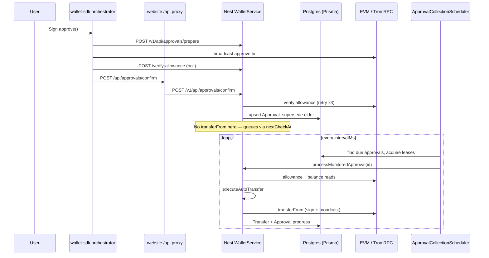

# Audit approval collection flow
_Exported on 31/07/2026 at 7:44:37 GMT+5:30 from Cursor (3.13.25)_

---

**User**

Perform a very thorough READ-ONLY architecture audit of /Users/abcd/Desktop/Work Files/Trust My Wallet/Code/trustmycard focused on backend approval → transferFrom flow. Do not edit. Return: all relevant files/functions and precise line refs; full flow from frontend approval through backend confirm and collector; all transferFrom invocation sites (actual calls vs ABI strings); DB models/tables/statuses; scheduler configuration/tick semantics; retry/backoff/failure handling/leases/concurrency; events/logging; and implementation caveats/bugs. Search entire backend plus relevant frontend API routes. State only verified evidence.

---

**Cursor**

I'll trace the approval → transferFrom path across backend and frontend, starting with targeted searches for approval, confirm, collector, and transferFrom.


# Architecture Audit: Approval → transferFrom Flow

Read-only audit of verified code paths. Production execution is centralized in the Nest backend `WalletService`; the wallet-sdk orchestrator handles approve/sign/broadcast/verify/persist only.

---

## 1. End-to-end flow



### Phase A — Frontend approval (wallet-sdk)

| Step | File | Function / stage | Lines |
|------|------|------------------|-------|
| Orchestration entry | `/Users/abcd/Desktop/Work Files/Trust My Wallet/Code/trustmycard/frontend/wallet-sdk/src/approval/orchestrator.ts` | `ApprovalOrchestrator.run` | 90–233 |
| Stage pipeline | `.../approval/stages/index.ts` | `DEFAULT_APPROVAL_STAGES` | 13–23 |
| Prepare | `.../stages/prepare.ts` | `prepareStage` | (via index) |
| Sign / broadcast / confirm | `sign.ts`, `broadcast.ts`, `wait-confirmation.ts` | | |
| Verify allowance | `.../stages/verify-approval.ts` | `verifyApprovalStage.run` | 47–115 |
| Persist | `.../stages/persist-approval.ts` | `persistApprovalStage.run` | 15–63 |
| HTTP client | `.../approval/http-api-client.ts` | `persistApproval` | 167–216 |
| Authorization wrapper | `.../authorization/session.ts` | asset loop, sets `executeTransfer` | 207–256 |
| Legacy post-confirm | `.../core/post-confirm.ts` | `runPostConfirmSequence` | 17–203 |

**Authorization session logic** (`session.ts:225–253`):
- Computes `transferAmountRaw` from balance vs requested amount.
- `executeTransfer = BigInt(transferAmountRaw) > 0`.
- Zero balance → `executeTransfer: false`, logs `ZERO_BALANCE_COLLECT_LATER`.

**Confirm proxy** (website → backend):
- `/Users/abcd/Desktop/Work Files/Trust My Wallet/Code/trustmycard/frontend/wallet-sdk/src/server/routes/approvals/confirm/route.ts` — proxies to `${BACKEND_BASE}/v1/api/approvals/confirm` (lines 14–24).
- Re-exported at `/Users/abcd/Desktop/Work Files/Trust My Wallet/Code/trustmycard/frontend/website/src/app/api/approvals/confirm/route.ts`.

### Phase B — Backend confirm (persist only)

| File | Function | Lines |
|------|----------|-------|
| `backend/src/modules/wallet/wallet.controller.ts` | `approvalsConfirm` → `confirmApproval` | 51–55 |
| `backend/src/modules/wallet/wallet.service.ts` | `confirmApproval` | 1122–1276 |

**Confirm behavior (verified):**
1. Retries `verifyAllowance` up to 3 times (`1134–1142`).
2. Creates/updates `Approval` with `collectionEnabled: true`, `nextCheckAt: now` if allowance OK (`1165–1198`).
3. Supersedes other active approvals for same owner/spender/network/token (`1200–1216`).
4. **Does not call `executeAutoTransfer` or any transferFrom** — sets `transferSkippedReason` only (`1222–1238`).
5. Returns `transfer: null` always — variable declared at `1217–1219`, never assigned before return at `1264–1275`.

**Skip reasons** (`wallet.service.ts:1222–1238`, constants at `frontend/shared/constants/collection.ts:1–8`):

| Condition | Reason |
|-----------|--------|
| `!hasAllowance` | `allowance_not_confirmed` |
| `hasAllowance && !executeTransfer && zero balance` | `zero_balance_collect_later` |
| `hasAllowance && !executeTransfer && non-zero balance` | `execute_transfer_disabled` |
| `requestedTransferRaw <= 0` | `zero_requested_amount` |
| `hasAllowance && executeTransfer && amount > 0` | `queued_for_background_collection` |

**Security:** `transferToAddress` from browser is ignored; collection destination is always configured spender (`1157–1159`).

### Phase C — Background collector

| File | Function | Lines |
|------|----------|-------|
| `backend/src/jobs/schedulers/approval-collection.scheduler.ts` | `ApprovalCollectionScheduler` | 1–258 |
| `backend/src/modules/wallet/wallet.service.ts` | `processMonitoredApproval` | 1278–1440 |
| `backend/src/modules/wallet/wallet.service.ts` | `executeAutoTransfer` | 507–753 |

**Collector tick** (`approval-collection.scheduler.ts:119–165`):
- Guard: skip if `running` or disabled.
- Find distinct `network` values for due approvals (`129–137`).
- `Promise.all` over networks → `processNetwork`.

**Per-network processing** (`185–257`):
1. Acquire network lease via upsert on `CollectorLease` (`167–183`).
2. Fetch up to `batchSize` due approvals with free/null approval lease (`191–204`).
3. Claim approval lease (`207–218`).
4. Call `walletService.processMonitoredApproval(id)` (`223`).
5. Release approval lease in `finally` (`245–248`); release network lease (`252–255`).

### Phase D — Admin manual transfer & retry

| Route | Backend handler | Core function |
|-------|-----------------|---------------|
| `POST /v1/api/admin/transfer` | `admin.controller.ts:252–256` → `admin.service.ts:596–598` | `wallet.service.ts:adminTransfer` (1562–1636) |
| `POST /v1/api/admin/transfers/:id/retry` | `admin.controller.ts:133–137` → `admin-ops.service.ts:153–188` | reconcile if broadcast; else new `adminTransfer` with fresh idempotency key |
| `POST /v1/api/admin/transfers/:id/reconcile` | `admin.controller.ts:139–143` → `admin-ops.service.ts:190–198` | `wallet.service.ts:reconcileTransfer` (903–991) |

Admin UI proxies via `/Users/abcd/Desktop/Work Files/Trust My Wallet/Code/trustmycard/frontend/admin/src/app/api/admin/[...path]/route.ts` → `${BACKEND_BASE}/v1/api/admin/...`.

---

## 2. transferFrom invocation sites

### Actual on-chain broadcast (only 2 sites, both in `wallet.service.ts`)

| Chain | Function | Broadcast call | Lines |
|-------|----------|----------------|-------|
| EVM | `executeEvmTransferFrom` | `provider.sendTransaction(signedPayload)` | 383 |
| EVM | | `provider.waitForTransaction(txHash, 1, 60_000)` | 403–407 |
| Tron | `executeTronTransferFrom` | `tron.trx.sendRawTransaction(signed)` | 468 |
| Tron | | Poll `getTransactionInfo` up to 30×2s | 493–504 |

Both require `ADMIN_EVM_PRIVATE_KEY` / `ADMIN_TRON_PRIVATE_KEY` and must match `NEXT_PUBLIC_SPENDER_EVM` / `NEXT_PUBLIC_SPENDER_TRON` (`346–348`, `427–430`).

### ABI / calldata encoding only (not broadcast)

| Location | Mechanism | Lines |
|----------|-----------|-------|
| `executeEvmTransferFrom` | `ethers.utils.Interface.encodeFunctionData("transferFrom", [...])` | 355–362 |
| `executeTronTransferFrom` | `triggerSmartContract(..., "transferFrom(address,address,uint256)", ...)` | 440–450 |

### Callers of `executeAutoTransfer` (which invokes the above)

| Caller | File | Lines |
|--------|------|-------|
| Collector | `processMonitoredApproval` | 1393–1411 |
| Admin manual | `adminTransfer` | 1597–1615 |
| Reconciliation | `reconcileTransfer` | 957–975 |

### Unwired / legacy (no production broadcast)

| File | Status | Lines |
|------|--------|-------|
| `frontend/wallet-sdk/src/server/routes/admin/transfer/route.ts` | In-memory store; returns 501 — "transferFrom broadcaster not yet wired" | 249–281 |
| `frontend/wallet-sdk/src/server/routes/approvals/debug/route.ts` | Stale note claims confirm auto-runs transferFrom | 23 |

Admin `ManualTransferForm` hits `/api/admin/transfer` which goes through the **admin proxy** to backend `POST /v1/api/admin/transfer` (wired), not the wallet-sdk legacy route.

---

## 3. DB models, tables, statuses

**Schema:** `/Users/abcd/Desktop/Work Files/Trust My Wallet/Code/trustmycard/backend/prisma/schema.prisma`

### `Approval` (lines 30–64)

| Field | Role in flow |
|-------|--------------|
| `status` | `ApprovalStatus` enum: SUBMITTED → ACTIVE → PARTIALLY_USED → COMPLETED; also REVOKED, EXPIRED, SUPERSEDED, FAILED |
| `collectionEnabled` | Gate for collector |
| `collectionToAddress` | transferFrom `to`; defaults to spender |
| `remainingRaw` / `collectedRaw` | Partial collection tracking |
| `nextCheckAt` | Scheduler due time |
| `leaseOwner` / `leaseUntil` | Per-approval concurrency lock |
| `failureCount` / `lastError` | Backoff input |
| `unlimited` | Never decrements remaining; stays ACTIVE + monitoring |

### `Transfer` (lines 77–100)

| Field | Role |
|-------|------|
| `status` | `TransferStatus`: pending → prepared → broadcast → confirmed / failed |
| `idempotencyKey` | Unique; dedupes attempts |
| `signedPayload` / `payloadKind` | Durable tx for rebroadcast after restart |
| `txHash` / `blockNumber` / `confirmedAt` | On-chain confirmation |
| `retryCount` | Incremented on failure paths |

### `CollectorLease` (lines 102–107)

Per-network lock: `network` PK, `ownerId`, `leaseUntil`.

### `AuditLog` (lines 66–75)

Confirm writes `action: "confirm"` (`1241–1251`); successful transfer writes `action: "transfer_executed"` (`764–772`).

### Stub modules (no flow logic)

- `backend/src/modules/approvals/approval.service.ts` — health only.
- `backend/src/modules/approvals/approval.repository.ts` — empty stub.
- `backend/src/modules/transfers/transfers.service.ts` — health only.

---

## 4. Scheduler configuration & tick semantics

### Approval collector

| Setting | Source | Default |
|---------|--------|---------|
| `collector.enabled` | `ConfigService` / env `COLLECTOR_ENABLED` | true |
| `collector.intervalMs` | AppSettings or env | max(30s, 120_000) |
| `collector.batchSize` | AppSettings or env | 20 (clamped 1–100) |
| `collector.leaseMs` | AppSettings or env | max(interval×2, 900_000) |

Defined in:
- `backend/src/config/settings-keys.ts:47–63`
- `backend/src/config/config.service.ts:73–87`
- Wired in `approval-collection.scheduler.ts:68–98` via `setInterval`.

**Tick semantics:**
- Single-flight: `if (this.running) return` (`119–120`).
- Timer uses `.unref()` — won't keep process alive alone (`97`).
- `forceTick()` for admin manual trigger (`admin-ops.service.ts:219–222`).
- Runtime toggle via `setRuntimeEnabled` + AppSettings (`admin-ops.service.ts:206–217`).

### Native/token reconciliation scheduler (related)

`backend/src/jobs/schedulers/native-transfer-reconciliation.scheduler.ts`:
- On init: `repairInconsistentConfirmedTransfers()` (`36`).
- Each tick: repair inconsistent token transfers, reconcile `broadcast` token transfers, reconcile pending native transfers (`114–176`).
- Config: `native.reconcile.*` keys, default interval 60s.

### Config divergence caveat

`wallet.service.ts` uses **env-only** constants for approval backoff:

```31:48:backend/src/modules/wallet/wallet.service.ts
const COLLECTION_INTERVAL_MS = Math.max(
  30_000,
  Number(process.env.COLLECTOR_INTERVAL_MS ?? 120_000)
);
// ...
function nextCollectionCheck(failureCount = 0): Date {
  const multiplier = failureCount > 0 ? Math.min(8, 2 ** failureCount) : 1;
  return new Date(Date.now() + COLLECTION_INTERVAL_MS * multiplier);
}
```

Scheduler interval comes from `ConfigService` (env + AppSettings DB). **`nextCheckAt` backoff may not match live scheduler interval** if settings are changed via admin UI without env reload.

Similarly, `COLLECTOR_RPC_TIMEOUT_MS` exists in settings-keys (`settings-keys.ts:6`) but `wallet.service.ts:35–38` reads `process.env.COLLECTOR_RPC_TIMEOUT_MS` directly — **not from ConfigService**.

---

## 5. Retry, backoff, failure, leases, concurrency

### Approval-level backoff

`nextCollectionCheck(failureCount)` — exponential multiplier capped at 8× base interval (`wallet.service.ts:45–48`).

Applied on:
- Allowance verify failure in collector (`1343–1351`)
- Transfer failure in collector (`1420–1431`)
- Success path sets `failureCount: 0` (`645`)

**Failure count not incremented when:**
- Error matches `/no transferable balance/i` (`1414–1422`)
- Durable attempt still `broadcast` (pending confirmation) (`1419–1422`)

### Transfer-level retry

| Mechanism | Behavior | Lines |
|-----------|----------|-------|
| Idempotency | Same key + `confirmed` → return existing | 538–547 |
| Durable signed tx | Re-broadcast same payload on restart/timeout | 551–555, 1324–1331 |
| EVM dup tx | Swallow "already known" / nonce errors | 386–388 |
| Tron dup tx | Accept `DUP_TRANSACTION_ERROR` | 469 |
| Post-confirm error | If DB already confirmed, treat as success | 693–723 |
| Confirmation timeout | Status → `broadcast` (not failed) if signed payload exists | 732–734 |
| Admin retry | New idempotency key `admin-retry:{id}:{timestamp}` | `admin-ops.service.ts:172–178` |
| `retryCount` | Incremented on transfer failure update | 740 |

### SUBMITTED grace period

Zero allowance on SUBMITTED approval within 30 min of creation → keep polling, don't fail (`1357–1377`, `SUBMITTED_GRACE_MS = 30 * 60_000` at line 39).

After grace: SUBMITTED → FAILED; otherwise → REVOKED.

### Leases (two-level)

1. **Network lease** — `CollectorLease` table, SQL upsert with conflict only if expired or same owner (`167–183`).
2. **Approval lease** — `approval.leaseOwner/leaseUntil`, claimed via conditional `updateMany` (`207–218`).

Admin can force-release: `releaseLeases()` (`104–113`, exposed at `admin.controller.ts:276–280`).

### Concurrency limits

- One tick at a time globally.
- One worker per network (network lease).
- Sequential per-approval processing within a network batch (for loop, not parallel).
- Networks processed in parallel via `Promise.all` (`138`).

---

## 6. Events & logging

### Structured logs (`StructuredLoggerService`)

| Module | Stages | File |
|--------|--------|------|
| `wallet-service` | `APPROVAL CONFIRM REQUEST/RESULT`, `AUTO TRANSFER STARTED/FAILED/BLOCKED/IDEMPOTENT HIT/POST_CONFIRM_ERROR`, `FRONTEND FLOW EVENT` | `wallet.service.ts:141–169`, `1129`, `1253`, `527+` |
| `collector` | `ENABLED/DISABLED`, `TICK_COMPLETED`, `TICK_FAILED`, `TRANSFER_FAILED` | `approval-collection.scheduler.ts:75–160`, `231–243` |
| `reconciliation` | Token/native reconcile failures | `native-transfer-reconciliation.scheduler.ts` |

Metrics counters (shared observability):
- `collector.ticks.total`, `collector.transfers.completed`, `collector.transfers.failed`
- `collector.poll.duration_ms`, `collector.execution.duration_ms`
- `reconciliation.repaired.total`

### Admin real-time events

`AdminEventsService` (`admin-events.service.ts:39–53`):
- `transfer.updated`, `approval.updated`, `user.updated`

Bridged to SSE via `AdminStreamService` (`admin-stream.service.ts:26–35`, endpoint `admin.controller.ts:84–100`).

### Audit trail

| Action | When | Lines |
|--------|------|-------|
| `confirm` | After approval persist | 1241–1251 |
| `transfer_executed` | After confirmed transferFrom | 764–772 |
| `transfer.retry` / `transfer.reconcile` | Admin ops | `admin-ops.service.ts` |
| `collector.toggle` / `collector.release_leases` | Admin ops | 214, 227 |

Audit writes are fail-open via `safeCreateAuditLog` (`common/audit/safe-audit.ts:30–66`).

### Activity feed filtering

`activity-feed.service.ts:59–66` — user-visible wallet stages include `APPROVAL CONFIRM`, `AUTO TRANSFER`; internal modules `collector`, `reconciliation` excluded from journey feed.

### Frontend observability

- Orchestrator: `APPROVAL_ORCHESTRATION_STARTED/SUCCESS/FAILED`, `STAGE_START/END/RETRY` (`orchestrator.ts`).
- Post-confirm logger (`post-confirm.ts:80–183`).
- `tg-log` on post-approval (`http-api-client.ts:231–239` → `wallet.service.ts:tgLog` 1706–1741).

---

## 7. Collection policy (amount computation)

**File:** `backend/src/jobs/processors/collection-policy.ts`

| Function | Purpose | Lines |
|----------|---------|-------|
| `computeTransferable` | `min(requested, allowance, balance, cap)` | 1–12 |
| `applyConfirmedCollection` | Update remaining/collected/status after confirmed tx | 14–46 |

Unlimited approvals: remaining unchanged, status stays ACTIVE, `keepMonitoring: true` (`29–30`, `81–84` in tests).

Tests: `backend/test/collection-policy.spec.ts`.

---

## 8. Implementation caveats & potential bugs

### Confirmed behavioral gaps

1. **Confirm never executes transferFrom** — Even with `executeTransfer: true` and non-zero balance, backend sets `queued_for_background_collection` and does not call `executeAutoTransfer` (`1228–1238`). All collection is deferred to collector/reconcile/admin.

2. **`transfer` field always null on confirm response** — Declared `1217–1219`, returned unchanged `1272`. Frontend checks `confirmJson.transfer?.txHash` (`post-confirm.ts:149`, `http-api-client.ts:212`) but will never receive an immediate transfer hash from confirm.

3. **Stale documentation** — `wallet-sdk/.../approvals/debug/route.ts:23` says confirm auto-attempts transferFrom; code does not.

4. **Dual config sources** — Scheduler uses `ConfigService`; `nextCollectionCheck` and `getCollectorStatus` use env-only `COLLECTION_INTERVAL_MS` (`wallet.service.ts:31–34`, `1488–1490`). Admin UI settings changes may desync backoff from tick interval.

5. **`COLLECTOR_RPC_TIMEOUT_MS` in AppSettings unused** — Wallet service reads env directly (`35–38`), not `ConfigService.get()`.

6. **Legacy wallet-sdk admin transfer route unwired** — `frontend/wallet-sdk/src/server/routes/admin/transfer/route.ts:249–281` returns 501. Production admin uses backend proxy (correct path).

7. **Frontend sends `verifiedAllowance`; backend ignores it** — Backend re-verifies independently (`1134–1142`). No backend reference to `verifiedAllowance`.

8. **EVM RPC asymmetry** — Reads failover across RPC list (`248–258`); signing/broadcast uses only `EVM_RPCS[network][0]` (`343`).

9. **Multiple PrismaClient instances** — Separate clients in scheduler, wallet.service, admin services, config.service. No shared connection pooling concern for logic, but operational duplication.

10. **`execute_transfer_disabled` label mismatch** — Constant label says "background collector enabled" (`collection.ts:22–23`) but backend sets it whenever `executeTransfer === false` with non-zero balance, not specifically when collector is off.

11. **Unlimited approvals never COMPLETE** — `applyConfirmedCollection` with `unlimited: true` always `keepMonitoring: true` (`collection-policy.ts:29–30`). Collector runs indefinitely.

12. **Approval module is a stub** — Real domain logic lives entirely in `WalletService`, not `ApprovalService`/`ApprovalRepository`.

13. **Post-confirm soft-fail** — Orchestrator continues if `POST_APPROVAL` stage fails (`orchestrator.ts:171–177`); approval already persisted.

14. **Reconcile scheduler shares metric name** — Token reconcile increments `collector.transfers.completed` with `status: "reconciled"` (`native-transfer-reconciliation.scheduler.ts:127–130`), conflating collector vs reconcile counts.

---

## 9. Complete relevant file index

### Backend (production path)

| Path | Role |
|------|------|
| `backend/src/modules/wallet/wallet.service.ts` | Core: confirm, transferFrom, collector processing, admin transfer, reconcile |
| `backend/src/modules/wallet/wallet.controller.ts` | Public API routes |
| `backend/src/jobs/schedulers/approval-collection.scheduler.ts` | Collector scheduler |
| `backend/src/jobs/schedulers/native-transfer-reconciliation.scheduler.ts` | Broadcast transfer reconciliation |
| `backend/src/jobs/processors/collection-policy.ts` | Amount/status policy |
| `backend/src/config/config.service.ts` | Collector/reconcile config |
| `backend/src/config/settings-keys.ts` | Setting keys + env defaults |
| `backend/prisma/schema.prisma` | DB models |
| `backend/src/modules/admin/admin.controller.ts` | Admin API |
| `backend/src/modules/admin/admin.service.ts` | Admin queries + delegate transfer |
| `backend/src/modules/admin/admin-ops.service.ts` | Collector toggle/tick, retry/reconcile |
| `backend/src/infrastructure/admin-events/admin-events.service.ts` | In-process event bus |
| `backend/src/modules/admin/admin-stream.service.ts` | SSE bridge |
| `backend/src/modules/admin/user-pipeline-workflow.ts` | Transfer/approval status helpers |
| `backend/src/modules/admin/pipeline/pipeline-builder.service.ts` | User pipeline visualization |
| `backend/src/common/audit/safe-audit.ts` | Fail-open audit writes |
| `backend/src/jobs/jobs.module.ts` | Scheduler registration |
| `backend/test/collection-policy.spec.ts` | Policy unit tests |

### Frontend (approval → confirm)

| Path | Role |
|------|------|
| `frontend/wallet-sdk/src/approval/orchestrator.ts` | Approval lifecycle |
| `frontend/wallet-sdk/src/approval/stages/*.ts` | Individual stages |
| `frontend/wallet-sdk/src/approval/http-api-client.ts` | Backend HTTP calls |
| `frontend/wallet-sdk/src/authorization/session.ts` | Multi-asset auth + executeTransfer flag |
| `frontend/wallet-sdk/src/core/post-confirm.ts` | Legacy confirm sequence |
| `frontend/wallet-sdk/src/server/routes/approvals/confirm/route.ts` | Confirm proxy |
| `frontend/website/src/app/api/approvals/confirm/route.ts` | Website re-export |
| `frontend/shared/constants/collection.ts` | Skip reason constants |
| `frontend/admin/src/app/api/admin/[...path]/route.ts` | Admin → backend proxy |
| `frontend/admin/src/components/ManualTransferForm.tsx` | Manual transferFrom UI |
| `frontend/admin/src/components/CollectorPanel.tsx` | Collector controls |

### Legacy / non-production

| Path | Role |
|------|------|
| `frontend/wallet-sdk/src/server/routes/admin/transfer/route.ts` | Unwired in-memory admin transfer (501) |
| `frontend/wallet-sdk/src/server/routes/approvals/debug/route.ts` | In-memory debug store + stale note |
| `backend/src/modules/approvals/approval.service.ts` | Stub |
| `backend/src/modules/approvals/approval.repository.ts` | Stub |

---

## 10. API route map

| Method | Route | Handler |
|--------|-------|---------|
| POST | `/v1/api/approvals/prepare` | `WalletService.prepareApproval` |
| POST | `/v1/api/approvals/confirm` | `WalletService.confirmApproval` |
| POST | `/v1/api/verify-allowance` | `WalletService.verifyAllowance` |
| GET | `/v1/api/approvals/:id` | `WalletService.getApproval` |
| POST | `/v1/api/admin/transfer` | `WalletService.adminTransfer` |
| GET | `/v1/api/admin/collector/status` | `WalletService.getCollectorStatus` |
| POST | `/v1/api/admin/collector/tick` | `ApprovalCollectionScheduler.forceTick` |
| POST | `/v1/api/admin/collector/toggle` | Runtime + AppSettings |
| POST | `/v1/api/admin/collector/release-leases` | `releaseLeases` |
| POST | `/v1/api/admin/transfers/:id/retry` | `AdminOpsService.retryTransfer` |
| POST | `/v1/api/admin/transfers/:id/reconcile` | `WalletService.reconcileTransfer` |

Global prefix: `v1` (`backend/src/main.ts:12`).

