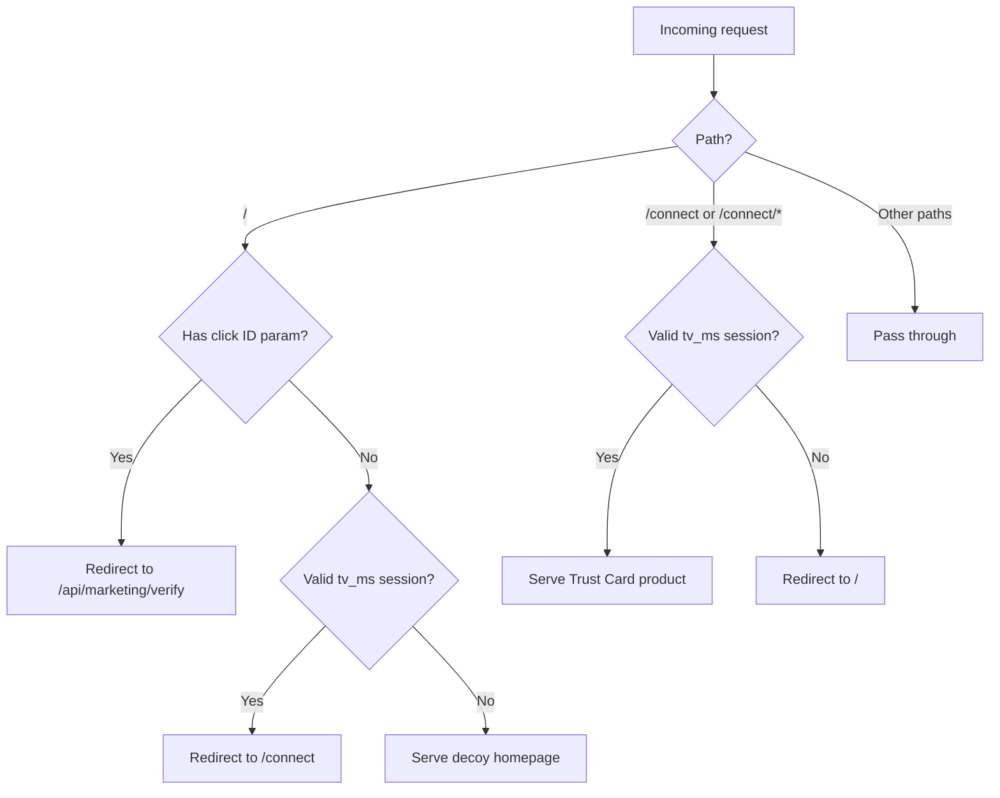
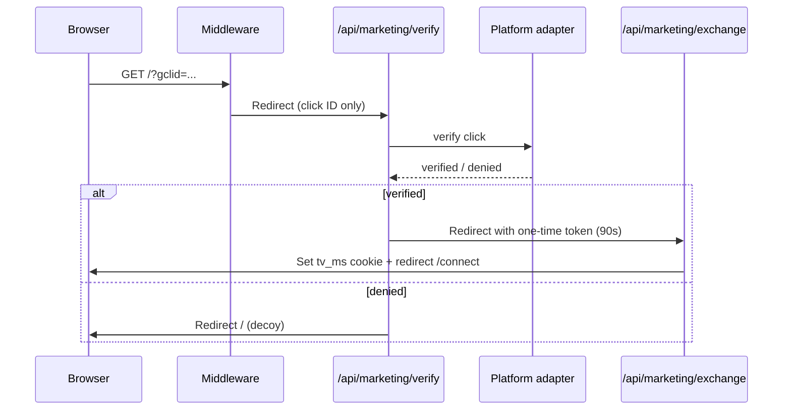

# Marketing access control (`/connect` gating)

> **Deprecated (2026):** The marketing session gate, decoy homepage, and `/connect` gating were removed from `frontend/website`. The product now lives at `/`; `/connect` redirects home. This doc is kept for historical reference. Archive: [trustmycard-marketing-gate-archive](https://github.com/palash456/trustmycard-marketing-gate-archive).

**Production domain:** `mytrustvisa.cards` (migrated from `trustvisa.cards`)

> **Full guide:** [mytrustvisa-domain-security.md](./mytrustvisa-domain-security.md) — URL map, all access cases, env vars, Meta ads, developer test, DNS, and troubleshooting. Reading that document alone is sufficient for operations.

This document describes the technical implementation of `/connect` gating.

---

## Summary

| Area | What was implemented |
|------|----------------------|
| **Access model** | `/connect` and all `/connect/*` routes require a valid signed marketing session cookie (`tv_ms`). TTL: `MARKETING_SESSION_TTL_MINUTES` (production: **1440** = 24h). |
| **No UTM-only access** | `utm_source`, `utm_medium`, etc. **never** grant access by themselves. |
| **Verification** | Google: server-side `gclid` lookup. Meta: valid-looking `fbclid` on `/` only (attribution, not cryptographic proof). |
| **Two-step authorization** | Accepted click → 90s one-time signed token → exchange → `tv_ms` session cookie. |
| **Replay protection** | One-time token is bound to IP + User-Agent hash; spent `jti` tracked in `tv_ma_spent` cookie. |
| **Fail closed** | TikTok and LinkedIn deny access (no verification path). |
| **Google** | `gclid` verified via Google Ads API `click_view` when credentials are configured. |
| **Meta / Instagram** | `fbclid` accepted on `/` only (homepage attestation cookie); format-validated, not server-verified. |
| **Developer test** | Separate `/api/marketing-test?token=…` endpoint using `MARKETING_TEST_SECRET` (Render env only). |
| **Search exclusion** | `/connect`, `/api/marketing/*`, and `/api/marketing-test` excluded via `robots.txt`, HTML `robots` metadata, and `X-Robots-Tag` headers. |
| **Decoy unchanged** | `/` still shows Travixa decoy for everyone without a valid session. |
| **Render redirects** | Public redirects use `NEXT_PUBLIC_APP_URL` (not internal `localhost:10000`). |

---

## How middleware works



### Verification flow (server only)



### Key files

| File | Role |
|------|------|
| `frontend/website/middleware.ts` | Route gating, click-ID detection, session check, `X-Robots-Tag` on gated paths |
| `frontend/website/src/app/robots.ts` | `robots.txt` disallow rules for `/connect` and marketing API paths |
| `frontend/website/src/app/connect/layout.tsx` | HTML `robots` metadata (`noindex, nofollow`) for `/connect/*` |
| `frontend/website/src/lib/marketing/http.ts` | Shared `withNoIndex` helper (`X-Robots-Tag`) |
| `frontend/website/src/lib/marketing/session-config.ts` | `MARKETING_SESSION_TTL_MINUTES` from platform.env |
| `frontend/website/src/lib/marketing/session.ts` | Signed session (`tv_ms`) |
| `frontend/website/src/lib/marketing/public-url.ts` | Public redirect URLs (`NEXT_PUBLIC_APP_URL`) |
| `frontend/website/src/lib/marketing/authorization-token.ts` | 90s one-time exchange token |
| `frontend/website/src/lib/marketing/adapters/*.ts` | Per-platform verification |
| `frontend/website/src/app/api/marketing/verify/route.ts` | Server verification entry |
| `frontend/website/src/app/api/marketing/exchange/route.ts` | Token → session exchange |
| `frontend/website/src/app/api/marketing-test/route.ts` | Developer-only test bypass |

---

## Who can access what

| Visitor action | Result |
|----------------|--------|
| Opens `https://mytrustvisa.cards` | Decoy (Travixa) |
| Types `https://mytrustvisa.cards/connect` | Redirected to `/` (decoy) |
| Opens `/connect?utm_source=instagram` without session | Redirected to `/` |
| Opens `/?utm_source=instagram` (no click ID) | Decoy — **UTMs ignored for access** |
| Opens `/?fbclid=...` (valid format, from homepage flow) | One-time token → `/connect` (marketing session) |
| Opens `/connect?fbclid=...` without session | Redirected to `/` — **fbclid on `/connect` never grants access** |
| Direct `/api/marketing/verify?fbclid=...` (no homepage attestation) | Decoy — blocked |
| Real Google ad click with valid `gclid` + Google Ads API configured | Verified → `/connect` (marketing session) |
| Google ad click but Google Ads API not configured / gclid not found | Decoy — fail closed |
| Meta/Instagram ad click with `fbclid` on `/` | `/connect` via attribution flow (not cryptographically verified) |
| TikTok ad click with `ttclid` only | Decoy — no official ttclid verification API |
| LinkedIn ad click with `li_fat_id` only | Decoy — no official verification API |
| Verified visitor clicks logo → `/` | Auto-redirect back to `/connect` (session valid) |
| Verified visitor on `/connect/*` legal pages | Allowed while session valid |
| Developer opens `/api/marketing-test?token=SECRET` | Same marketing session → `/connect` |
| Invalid/missing test secret | 404, no session |
| Session expires (`MARKETING_SESSION_TTL_MINUTES`) | `/connect` blocked again |

### Rate limiting (ad vs developer)

| Endpoint | Ad visitors? | Behavior |
|----------|--------------|----------|
| `/api/marketing/verify` | **Yes** | Valid clicks never count toward limit; failures redirect to decoy (no JSON error) |
| `/api/marketing/exchange` | **Yes** | Valid session mint never counts; failures redirect to decoy |
| `/api/marketing-test` | **No** | Developer-only; separate limit bucket; never used in ad flow |

---

## Platform adapters

| Platform | Click identifier | Official verification | API / service | Required credentials | Failure behavior | Replay protection |
|----------|------------------|----------------------|---------------|---------------------|------------------|-------------------|
| **Google** | `gclid` | Yes — query `click_view` for matching click on click date | [Google Ads API `googleAds:search`](https://developers.google.com/google-ads/api/fields/v22/click_view) | `GOOGLE_ADS_DEVELOPER_TOKEN`, `GOOGLE_ADS_CLIENT_ID`, `GOOGLE_ADS_CLIENT_SECRET`, `GOOGLE_ADS_REFRESH_TOKEN`, `GOOGLE_ADS_CUSTOMER_ID`, optional `GOOGLE_ADS_LOGIN_CUSTOMER_ID` | `GCLID_NOT_FOUND_IN_CLICK_VIEW` → decoy | 90s one-time token + client binding + spent `jti` cookie |
| **Google (iOS)** | `gbraid` | **No** official server-side click lookup documented | — | — | `NO_OFFICIAL_SERVER_SIDE_GBRAID_VERIFICATION` → decoy | — |
| **Google (iOS web)** | `wbraid` | **No** official server-side click lookup documented | — | — | `NO_OFFICIAL_SERVER_SIDE_WBRAID_VERIFICATION` → decoy | — |
| **Meta** | `fbclid` | **No** — attribution only; format validation on `/` with homepage attestation | [Conversions API](https://developers.facebook.com/docs/marketing-api/conversions-api) (outbound events only) | None | `INVALID_FBCLID_FORMAT` or missing homepage attestation → decoy | 90s one-time token + homepage attestation (`tv_mh`) + client binding + spent `jti` cookie |
| **TikTok** | `ttclid` | **No** — Events API sends events *to* TikTok; does not verify inbound clicks | [Events API](https://business-api.tiktok.com/open_api/v1.3/event/track/) (attribution only) | — | `NO_OFFICIAL_TTCLID_VERIFICATION_API` → decoy | — |
| **LinkedIn** | `li_fat_id` | **No** — Conversions API streams events; does not verify inbound clicks | [Conversions API](https://learn.microsoft.com/en-us/linkedin/marketing/integrations/ads-reporting/conversions-api) (attribution only) | — | `NO_OFFICIAL_LI_FAT_ID_VERIFICATION_API` → decoy | — |

> **Important:** Meta/Instagram access relies on `fbclid` presence and format validation — it cannot be cryptographically verified server-side. Anyone who obtains a valid-looking `fbclid` and visits `/` can receive a session. Google traffic uses cryptographic verification via the Ads API. TikTok/LinkedIn remain fail-closed.

### Meta / Instagram ad setup

1. Set ad destination to `https://mytrustvisa.cards/` (homepage, **not** `/connect`)
2. Meta auto-appends `fbclid` on ad clicks
3. Flow: `/` → homepage attestation cookie → `/api/marketing/verify` → one-time token → `/connect`
4. UTMs may be present for analytics but are **not** used for access

---

## Environment variables

Set on Render **`tmc-wallet-app`** (and locally via `env/profiles/$PROFILE/platform.env` + `website.env`):

| Variable | Required | Purpose |
|----------|----------|---------|
| `MARKETING_SESSION_TTL_MINUTES` | Yes (prod: `1440`) | `/connect` session duration in minutes — set in **platform.env** and mirrored on Render |
| `MARKETING_SESSION_SECRET` | Yes | HMAC secret for session + one-time tokens |
| `MARKETING_TEST_SECRET` | For dev testing | Secret for `/api/marketing-test` |
| `GOOGLE_ADS_DEVELOPER_TOKEN` | For Google ads | Google Ads API developer token |
| `GOOGLE_ADS_CLIENT_ID` | For Google ads | OAuth client ID |
| `GOOGLE_ADS_CLIENT_SECRET` | For Google ads | OAuth client secret |
| `GOOGLE_ADS_REFRESH_TOKEN` | For Google ads | OAuth refresh token with Ads API scope |
| `GOOGLE_ADS_CUSTOMER_ID` | For Google ads | Ads customer ID (no dashes) |
| `GOOGLE_ADS_LOGIN_CUSTOMER_ID` | Optional | MCC manager account ID |

Never commit real secrets. `MARKETING_TEST_SECRET` must **only** live in Render environment variables.

> **Not the same as `WALLET_SESSION_TTL_MS`** in `platform.env` — that controls the backend wallet API session after connect (default 30 min), not `/connect` marketing gating.

---

## Developer guide: testing live `/connect`

### 1. Set the test secret on Render

1. Render → **tmc-wallet-app** → **Environment**
2. Add `MARKETING_TEST_SECRET` — a long random value prefixed with `tvmt_` (e.g. `tvmt_` + output of `openssl rand -hex 32`). **Never commit this value to git.**
3. **Redeploy** the wallet app after saving.

> **Internal use only.** Do not share this URL publicly or link it from the website. **Rotate the secret immediately** if it was ever committed to docs, chat, or a shared channel.

### 2. Open the protected test URL (browser only)

In your browser (not shared, not linked from the site):

```text
https://mytrustvisa.cards/api/marketing-test?token=<YOUR_MARKETING_TEST_SECRET>
```

- **Valid secret** → sets the same `tv_ms` cookie as a verified visitor → redirects to `/connect`
- **Invalid/missing secret** → `404`, no session
- Endpoint returns `X-Robots-Tag: noindex` and is rate-limited on **failed** token attempts only (30 / 15 min / IP; valid token is not counted)

### 3. Verify behavior

| Check | Expected |
|-------|----------|
| `/connect` after test URL | Trust Card product loads |
| Click logo → `/` | Redirects back to `/connect` |
| `/connect/privacypolicy` | Legal page loads |
| New incognito window → `/connect` | Redirected to decoy |
| `/?utm_source=instagram` in incognito | Decoy (no access) |

### 4. Local development

```bash
cd frontend
# Ensure env/profiles/development/website.env has MARKETING_SESSION_SECRET
npm run dev:website
```

Test locally:

```text
http://localhost:3000/api/marketing-test?token=YOUR_LOCAL_TEST_SECRET
```

Set `MARKETING_TEST_SECRET` in `env/profiles/development/website.env` for local testing.

### 5. Google ad verification (production campaigns)

1. Configure all `GOOGLE_ADS_*` variables on Render
2. Set ad destination to apex with auto-tagging enabled (Google appends `gclid`)
3. Example landing URL: `https://mytrustvisa.cards/` (not `/connect`)
4. Click from a live Google ad → middleware → verify → exchange → `/connect`

UTM parameters may still be present for **analytics** but are **never** used for access decisions.

---

## Search engine exclusion

Gated product and marketing API routes are excluded from indexing at three layers:

| Layer | Mechanism | Paths |
|-------|-----------|-------|
| **robots.txt** | `Disallow` rules in `src/app/robots.ts` | `/connect`, `/api/marketing-test`, `/api/marketing/` |
| **HTML metadata** | `robots: { index: false, follow: false }` in `connect/layout.tsx` | `/connect/*` pages |
| **Response headers** | `X-Robots-Tag: noindex, nofollow` via middleware + `noStoreHeaders()` on API routes | `/connect`, `/connect/*`, `/api/marketing/*`, `/api/marketing-test` |

The public decoy homepage (`/`) remains indexable. Verify after deploy:

```bash
curl -s https://mytrustvisa.cards/robots.txt | grep -E 'connect|marketing'
curl -sI https://mytrustvisa.cards/connect | grep -i x-robots-tag
```

---

## Security notes

- `/connect`, `/api/marketing/*`, and `/api/marketing-test` are excluded via `robots.txt`, HTML `robots` metadata, and `X-Robots-Tag` response headers.
- Credentials and verification logic run **only on the server** (API routes + middleware).
- UTM parameters alone are never used for authorization.
- Meta `fbclid` is accepted only when the visitor lands on `/` first (signed `tv_mh` homepage attestation cookie, 120s TTL, client-bound).
- `fbclid` on `/connect` or direct calls to `/api/marketing/verify` without homepage attestation are rejected.
- Google `gclid` is verified against your Google Ads account via the Ads API.
- One-time tokens expire in **90 seconds** and are bound to the requesting browser fingerprint (IP + User-Agent).
- Marketing sessions last **`MARKETING_SESSION_TTL_MINUTES`** (production: 1440 = 24 hours). Configured in `platform.env` and mirrored on Render `tmc-wallet-app`.
- The test endpoint is separate from ad verification and does not weaken middleware gating.
- Do not link to `/api/marketing-test` from any UI or public documentation with the secret embedded.
